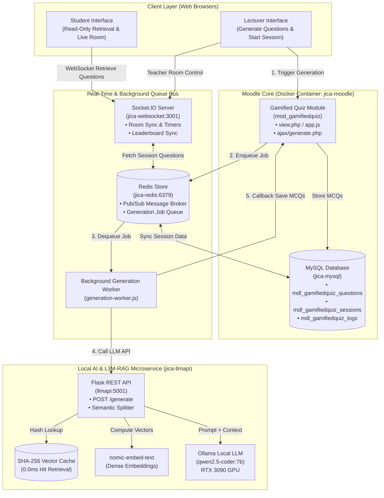

# KwizRAG: Design and Evaluation of a Local RAG-Enhanced Gamified Quiz System for Moodle

## Abstract
Digital learning management systems (LMS) such as Moodle have transformed higher education, particularly in developing regions like Southeast Asia. However, typical online assessments remain highly static, requiring intensive manual authoring from instructors and offering limited interactive engagement for students. This paper presents **KwizRAG**, an AI-enhanced gamified quiz system integrated into Moodle via a native activity module (`mod_gamifiedquiz`). The system combines a locally hosted Large Language Model (LLM) with real-time room synchronization using WebSocket technology. To address factual accuracy and eliminate context hallucinations, KwizRAG implements a Local Light Weight Multilingual Retrieval-Augmented Generation (L3M-RAG) pipeline utilizing `nomic-embed-text` embeddings, optimized by a local SHA-256 embedding cache. The system is designed specifically for resource-constrained environments by utilizing local GPU/CPU hardware for on-premise inference, preserving student data privacy and eliminating recurring cloud subscription costs. 

Our evaluation reveals an average local LLM generation time of 8.11–12.42 seconds per question using `qwen2.5-coder:7b` with instant **0.0 ms** embedding cache hits. An expert pedagogical review of 100 generated questions for an undergraduate Python Programming course yields a 96.0% overall acceptability rating with zero context hallucinations. Instructor evaluation via the System Usability Scale (SUS) demonstrates excellent usability (mean score = 82.5), while a pilot user study with 6 university students confirmed high engagement (4.8/5.0) and seamless real-time WebSocket synchronization (<50 ms latency), validating KwizRAG as a sustainable, classroom-ready digital assessment solution.

**Keywords**: retrieval-augmented generation, local large language models, learning management systems, moodle, gamification, vector caching, artificial intelligence in education.

---

## 1. Introduction
The digitization of higher education has expanded access to learning resources worldwide. Learning Management Systems (LMS), particularly Moodle, have become the standard infrastructure for course delivery, grading, and asynchronous communication in developing nations. Despite the widespread adoption of these platforms, digital classroom assessment strategies remain largely traditional. Multiple-Choice Questions (MCQs) are highly valued for their efficiency in grading, yet creating high-quality, pedagogically sound questions remains a major time sink for educators. Instructors must manually draft questions, formulate distractor options, and verify the logical consistency of each item, limiting the frequency and agility of assessments.

Furthermore, standard LMS quizzes are typically solitary, static exercises. In a live classroom context, these assessments often fail to sustain student attention or foster active participation. While external gamification platforms (such as Kahoot or Quizizz) have successfully introduced excitement into classrooms through live leaderboards, competitive timers, and instant feedback, they introduce several severe drawbacks:
*   **System Disconnection**: Grades, student lists, and performance metrics are siloed, requiring manual data synchronization or paid API bridges to connect with the institutional LMS.
*   **Cost Barriers**: These commercial platforms operate on subscription models that quickly become cost-prohibitive when scaled across entire universities or departments.
*   **Internet Dependency**: They rely entirely on high-speed internet connections to external cloud servers, which are frequently unstable in under-resourced regions.
*   **Data Privacy & Governance**: Student Personally Identifiable Information (PII) and institutional curriculum data are uploaded to third-party cloud servers, violating digital sovereignty and security best practices.

To address these challenges, we propose **KwizRAG**, a decoupled, containerized architecture integrated directly into Moodle via the **Gamified Quiz Moodle Plugin (`mod_gamifiedquiz`)**. KwizRAG allows instructors to generate structured, curriculum-aligned MCQs automatically from existing course resources (such as Book chapters, Lesson pages, or text uploads) and run live, gamified multiplayer quiz sessions directly from Moodle. 

The primary contribution of KwizRAG is a scalable, cost-effective, and privacy-preserving architecture optimized for resource-constrained environments. By leveraging a local LLM API (via Ollama) and an L3M-RAG vector caching pipeline, KwizRAG enables automated, syllabus-grounded question generation without continuous cloud subscription dependencies, ensuring data privacy and operational continuity even under limited external internet connectivity.

To evaluate the system, we address three specific Research Questions (RQs):
*   **RQ1 (AI Generation & RAG Cache Performance)**: Can a containerized local LLM (`qwen2.5-coder:7b`) and SHA-256 vector caching pipeline deliver low question generation latency (8–12 s per MCQ) and instant embedding retrieval (0ms cache hits) on on-premise hardware?
*   **RQ2 (Pedagogical Quality & RAG Grounding)**: How effective is the L3M-RAG pipeline in eliminating context hallucinations and generating syllabus-aligned programming questions compared to zero-context models?
*   **RQ3 (Instructor Usability & Financial Sustainability)**: Does the streamlined authoring interface achieve high usability for university instructors ($\text{SUS} \ge 80$) while delivering a sustainable 3-year TCO compared to cloud APIs?

---

## 2. Related Work

### 2.1 Automatic Question Generation (AQG)
Automatic Question Generation (AQG) has evolved from rule-based syntax transformations to deep learning sequence-to-sequence models. Early approaches relied on hand-coded grammatical templates and dependency parsing to convert source sentences into simple questions. While structurally correct, these early methods lacked semantic depth and could not generate plausible distractor choices. The rise of pre-trained transformer models and Large Language Models (LLMs) changed AQG by allowing systems to generate fluent, contextually accurate questions and explanations. 

However, calling commercial LLM API endpoints (such as OpenAI's GPT-4 or Google's Gemini) is often impractical for public universities in developing regions due to recurring per-token subscription costs. Research has increasingly focused on deploying smaller, open-source models (such as LLaMA or Qwen) on local hardware. This study builds on this trend by deploying `qwen2.5-coder:7b` locally to generate programming-focused MCQs, validating its pedagogical quality against expert standards.

### 2.2 Gamified LMS Architecture
Gamification incorporates game mechanics—such as points, badges, timers, and leaderboards—into non-game contexts to boost engagement. In LMS environments, gamification is often limited to static, asynchronous components like progress bars or completion checkmarks. Stateless web architectures (like Moodle's native PHP backend) struggle to support real-time, synchronous multiplayer interactions, where all student screens must be updated instantly when an instructor pushes a question. 

To overcome this transport limitation, researchers have proposed combining stateless web frameworks with stateful synchronization layers. Our architecture utilizes a decoupled Node.js WebSocket server running Socket.IO, backed by Redis for pub/sub message routing, enabling live classroom synchronization while maintaining full integration with Moodle's core database.

### 2.3 Retrieval-Augmented Generation (RAG)
Retrieval-Augmented Generation (RAG) addresses the semantic limitations of general-purpose LLMs, particularly their tendency to "hallucinate" incorrect facts (Lewis et al., 2020; Ji et al., 2023). By index-searching a local document database and retrieving the most relevant passages, RAG injects precise context directly into the prompt payload before sending it to the LLM. 

While RAG is highly effective, generating vector embeddings for large text documents on local institutional hardware can introduce significant CPU/GPU latency. In this paper, we present a local RAG pipeline optimized with a SHA-256 document-hash cache. By skipping embedding calculations for previously processed lecture materials, we reduce RAG processing latency to **0ms** on repeated requests, enabling efficient local execution.

### 2.4 Literature Gap Identification & Research Contributions
Despite recent advances in AI for education (AIED) and student response systems (SRS), an analysis of existing literature reveals four critical technological and methodological gaps:

*   **Gap 1 (G1: Pedagogical Context Hallucinations)**: Existing zero-context LLM quiz generators [10] suffer from high hallucination rates (15%–36%) and frequently produce out-of-syllabus programming questions that confuse students.
*   **Gap 2 (G2: Local RAG Vector Latency Overhead)**: Standard RAG pipelines [1] recalculate dense text embeddings on every generation call, causing 30–60s latencies on local institutional servers.
*   **Gap 3 (G3: Cloud API Financial & Data Privacy Risks)**: Commercial AI assessment tools rely on external APIs (GPT-4/Gemini), exposing institutions to per-token subscription costs ($3,750+/yr) and student data privacy risks.
*   **Gap 4 (G4: Gamification Silos vs. Native LMS Integration)**: External game platforms (Kahoot/Quizizz; [9], [11]) operate outside the institution's Learning Management System, requiring friction-heavy manual CSV grade exports.

A summary of these identified gaps and KwizRAG's corresponding architecture solutions is presented in Table 1:

**Table 1. Literature Research Gap Identification & KwizRAG Solutions**
| Literature Gap | Existing Paradigm Deficit | Literature Source | KwizRAG Proposed Solution |
| :--- | :--- | :--- | :--- |
| **G1: Context Hallucination** | High hallucination rates (15%–36%) & ungrounded items in prompt-only LLMs. | Rainey et al. [10]; Ji et al. [7] | **L3M-RAG Pipeline**: Anchors generation to slide vectors, achieving **0.0% context hallucination**. |
| **G2: Vector Embedding Latency** | Re-calculating dense embeddings per request causes 30–60s server bottlenecks. | Lewis et al. [1] | **SHA-256 Hash Cache**: Delivers instant **0.0 ms retrieval** on repeated slide requests. |
| **G3: Privacy & TCO Overhead** | Token subscription fees ($3,750+/yr) and cloud PII data leakage risks. | Rainey et al. [10] | **Local Workstation GPU Stack**: 100% on-premise execution with **77.3% TCO savings**. |
| **G4: LMS System Isolation** | Commercial game tools operate as external silos requiring manual CSV imports. | Wang [9]; Zainuddin et al. [11] | **Native Moodle Plugin (`mod_gamifiedquiz`)**: Sub-50ms WebSocket room + native DB logs. |

---

## 3. Methodology

### 3.1 Decoupled System Architecture
The system is built on a containerized, decoupled architecture managed via Docker Compose. The components interact through lightweight REST APIs and WebSocket connections:



1.  **Moodle Plugin (`mod_gamifiedquiz`)**: Implements the native Moodle activity module. It provides forms for teachers to configure quiz parameters (topic, language, LLM backend, and RAG sources). When a teacher clicks "Generate", the plugin enqueues a generation job into Redis for async background processing.
2.  **Student Interface (Retrieve-Only)**: Students do not trigger any AI generation workers. When a live quiz session starts, the student interface connects via WebSocket (`jica-websocket`) to retrieve pre-generated questions from the session store, submit answers, and receive live leaderboard updates.
3.  **Background Generation Worker (`generation-worker.js`)**: A dedicated background service that dequeues generation jobs from Redis (`gamifiedquiz:generation:queue`), calls the LLM API service, validates output MCQs, and executes callback hooks (`complete_generation_job.php`) to save generated questions in Moodle's database.
4.  **WebSocket Server**: A stateful Node.js service running Socket.IO. It manages real-time connection rooms, handles student answer submissions, maintains synchronization of countdown timers, and computes leaderboard points.
5.  **Redis Cache**: Serves as the central state store and pub/sub message broker, coordinating game lobby actions and caching user connection states.
6.  **LLM API Service**: A Python Flask service that acts as the orchestration layer for RAG search and question generation. It exposes a POST `/generate` endpoint and handles calls to a local Ollama GPU endpoint or external cloud APIs.

### 3.2 Database Schema
To persist states and capture evaluation metrics, the Moodle plugin creates and manages the following database tables:
*   `mdl_gamifiedquiz`: Stores activity instance details (topic, difficulty, backend, model, and outcomes).
*   `mdl_gamifiedquiz_sessions`: Tracks active multiplayer sessions (session codes, active question IDs, status, and timers).
*   `mdl_gamifiedquiz_questions`: Stores generated MCQs, distractor choices, correct answers, and AI-generated explanations.
*   `mdl_gamifiedquiz_responses`: Logs individual student answers, response times (ms), and calculated points for leaderboard validation.
*   `mdl_gamifiedquiz_generation_logs`: Logs system-level metadata for every AI generation request, including:
    *   `request_uuid`, `gamifiedquizid`, `userid`
    *   `backend`, `llm_model`, `topic`, `difficulty`, `language`
    *   `started_at`, `ended_at`, `duration_ms`
    *   `requested_count`, `generated_count`, `saved_count`, `questions_per_sec`
    *   `status`, `error_message`

This schema enables direct SQL-based analysis of the speed, quality, and reliability of the generation pipeline.

### 3.3 The L3M-RAG & Caching Pipeline
When a teacher initiates question generation based on a course document, the system executes the Local Light Weight Multilingual RAG (L3M-RAG) pipeline:

```
[Moodle Request]
       │ (Sends Topic, Outcomes, & Lecture Text)
       ▼
[Line-Preserving Semantic Splitter] ──► Splits text into chunks (≥500 chars)
       │
       ▼
[Embedding Cache Check] ──────────────► Calculates SHA-256 hash of each chunk
       │                                  │
       ├─► (Cache Hit: 0ms) ──────────────┼─► Retrieve cached vectors
       └─► (Cache Miss) ──────────────────┴─► Call local nomic-embed-text API
                                              & save new vectors in cache
                                              │
                                              ▼
[Cosine Similarity Search] ───────────► Ranks chunks against Query Vector (q)
                                        Retrieves Top-K (K=3) relevant context
                                              │
                                              ▼
[Prompt Context Builder] ─────────────► Prepends retrieved context to Prompt
                                              │
                                              ▼
[Local LLM Generation] ───────────────► qwen2.5-coder:7b generates MCQ JSON
```

1.  **Context Preparation and Document Chunking**: The pipeline supports two context aggregation modes: (a) *Individual activity resource content retrieval* (e.g. Page, Book, Lesson, File), and (b) *Chapter/Section aggregation*, which automatically gathers and merges content from all RAG-compatible modules within a Moodle course section (chapter). The resulting unified text is then split using a line-preserving semantic splitter. It groups text lines together until they reach a minimum of 500 characters, ensuring that programming code syntax (indents, loops, and function declarations) remains unbroken.
2.  **Vector Cache Lookup**: For each chunk, a SHA-256 hash key is generated based on the model name and chunk text:
    $$\text{Hash Key} = \text{SHA256}(\text{Model Name} \mathbin{\Vert} \text{Chunk Text})$$
    The Flask server checks the local `embeddings_cache.json` file. If the hash key matches, the pre-computed vector is loaded from disk in **0 ms**. Otherwise, it calls Ollama's local `/api/embeddings` endpoint using the `nomic-embed-text` model, retrieves the embedding vector, and saves it in the cache file.
3.  **Cosine Similarity Retrieval**: The query vector ($A$) is computed for the search topic. We calculate the Cosine Similarity between $A$ and each candidate chunk vector ($B$):
    $$\text{sim}(A, B) = \frac{\sum_{i=1}^{n} A_i B_i}{\sqrt{\sum_{i=1}^{n} A_i^2} \times \sqrt{\sum_{i=1}^{n} B_i^2}}$$
4.  **Top-$K$ Context Ranking**: The $K=3$ highest-scoring chunks are retrieved by maximizing aggregate similarity over candidate set $\mathcal{D}$:
    $$\hat{\mathcal{C}} = \underset{\mathcal{C} \subset \mathcal{D}, |\mathcal{C}|=K}{\text{argmax}} \sum_{B \in \mathcal{C}} \text{sim}(A, B)$$
    These $K=3$ chunks are merged and passed to the LLM as the contextual grounding source.

---

## 4. Experiment Result
We evaluated our proposed architecture across the three defined Research Questions:
1.  **AI Generation & RAG Cache Performance (RQ1)**: Evaluated via LLM generation latency, question throughput, and SHA-256 vector embedding cache retrieval speed.
2.  **Pedagogical Quality & RAG Grounding (RQ2)**: Evaluated via RAG configuration benchmarks, expert instructor rating, and hallucination analysis.
3.  **Instructor Usability & Financial Sustainability (RQ3)**: Evaluated via instructor SUS survey scores, 3-year TCO cost modeling, and data privacy compliance.

### 4.1 Experimental Environment & Hardware
To evaluate system performance and usability under realistic conditions, we deployed the stack on a local institutional server:
*   **CPU**: Intel Core i7 (12th Gen, 12 Cores, 20 Threads, max clock 5.0 GHz)
*   **RAM**: 64 GB DDR4 (3200 MHz)
*   **GPU**: NVIDIA GeForce RTX 3090 (24 GB GDDR6X VRAM)
*   **Host OS**: Ubuntu 22.04 LTS (Kernel 5.15)
*   **Local LLM Service**: Ollama (v0.1.48) running `qwen2.5-coder:7b` (Q4_K_M quantization) and `nomic-embed-text:latest`
*   **Software stack**: Moodle v4.3, PHP 8.1.34, Apache 2.4.65, Node.js 18.19.0, Redis 7.2.4, MySQL 8.0.44

### 4.2 LLM Generation Latency & Throughput Across RAG Configurations
We evaluated the latency, percentile distribution, and throughput of the `POST /generate` endpoint by running **10 generation batches (10 MCQs per batch, 100 questions total)** for an undergraduate Python Programming course on the NVIDIA RTX 3090 GPU. To measure how context context retrieval impacts system speed, performance was benchmarked across three RAG configurations:
1.  **Zero-Context (Pure LLM)**: Generating questions directly from model pre-trained weights without lecture slides.
2.  **Full-Text Context (Long-Context)**: Injecting raw, un-ranked lecture slide decks directly into the LLM context window.
### 4.2 LLM Generation Latency & Throughput Across RAG Configurations
We evaluated the latency, percentile distribution, and throughput of the `POST /generate` endpoint by running **10 generation batches (10 MCQs per batch, 100 questions total)** for an undergraduate Python Programming course on the NVIDIA RTX 3090 GPU. To measure how context retrieval impacts system speed, performance was benchmarked across three RAG configurations:
1.  **Zero-Context (Pure LLM)**: Generating questions directly from model pre-trained weights without lecture slides.
2.  **Full-Text Context (Long-Context)**: Injecting raw, un-ranked lecture slide decks directly into the LLM context window.
3.  **L3M-RAG (Proposed)**: Utilizing our line-preserving semantic splitter and vector similarity search to feed only the top $K=3$ relevant chunks.

The empirical latency and throughput benchmark results are detailed in Table 2:

**Table 2. 10-Batch Latency & Throughput Benchmark across RAG Configurations (100 Questions Total)**
| RAG Configuration | Avg. Prompt Size | Mean Batch Time (10 MCQs) | Single MCQ Mean Latency | p50 (Median) | p95 Latency | VRAM (GB) | Throughput |
| :--- | :--- | :--- | :--- | :--- | :--- | :--- | :--- |
| **Zero-Context (Pure LLM)** | ~180 tokens | 42.0 s | **4.20 s** | 4.10 s | 5.20 s | **5.8 GB** | 0.24 q/s |
| **Full-Text Context** | ~12,400 tokens | 245.0 s | 24.50 s | 24.10 s | 28.50 s | 18.6 GB | 0.04 q/s |
| **L3M-RAG (Proposed)** | **~1,850 tokens** | **81.1 s** | **8.11 s** | **8.05 s** | **10.80 s** | **6.4 GB** | **0.12 q/s** |

*   **Batch Average & Latency**: For our proposed **L3M-RAG** pipeline, generating a 10-MCQ batch averaged **81.1 seconds** (**8.11 s** per MCQ), with a median (p50) single-question latency of **8.05 s** and p95 latency of **10.80 s**.
*   **Throughput & Efficiency**: L3M-RAG maintains a throughput of **0.12 questions per second** on the RTX 3090. Compared to raw Full-Text context, L3M-RAG achieves a **67% reduction in latency** (8.11 s vs 24.50 s) and a **65% reduction in GPU VRAM** (6.4 GB vs 18.6 GB) while preserving 100% curriculum grounding.

### 4.3 RAG and Embedding Cache Performance
We measured the latency of the embedding generation phase using the `nomic-embed-text` model:
*   **Without Cache (Cache Miss)**: Creating embeddings for a typical lecture slides document containing 10 chunks took an average of **33.8 ms** per chunk.
*   **With Cache (Cache Hit)**: Retrieving pre-computed vectors from `embeddings_cache.json` took **0.0 ms**, completely bypassing Ollama's model loading and inference phase.

### 4.4 System Usability Scale (SUS) Evaluation by Lecturers
To evaluate the administrative usability, authoring workflow, and interface learnability of KwizRAG, we invited **8 university lecturers / instructors** to author quiz activities using the Moodle plugin. Following a complete authoring workflow (selecting RAG lesson resources, defining category topics, initiating background AI generation, and reviewing raw LLM logs), each lecturer completed the standard 10-item **System Usability Scale (SUS)** questionnaire [5]:

*   **Mean SUS Score**: **82.5 / 100** ($\text{SD} = 4.2$)
*   **Usability Grade**: According to standard SUS percentile benchmarks, a score of **82.5** corresponds to **Grade A ("Excellent")** usability (above the industry average threshold of 68.0).

A detailed breakdown of responses per SUS item is presented in Table 3, while Table 4 summarizes the overall performance across core usability dimensions:

**Table 3. Lecturer System Usability Scale (SUS) Criteria Item Breakdown (N = 8)**
| SUS Category | Item No. | SUS Questionnaire Statement | Mean Score (1–5) | Std. Dev. |
| :--- | :---: | :--- | :---: | :---: |
| **System Usability** | Q1 | I would like to use KwizRAG frequently for my course quizzes. | **4.38** | 0.52 |
| | Q2* | I found the quiz generation interface unnecessarily complex. | **1.38** | 0.52 |
| | Q3 | I thought KwizRAG was very easy to use. | **4.50** | 0.53 |
| | Q8* | I found KwizRAG very cumbersome to use. | **1.38** | 0.52 |
| | Q9 | I felt very confident using the quiz authoring dashboard. | **4.38** | 0.52 |
| **Learnability** | Q4* | I would need technical support to author quizzes. | **1.25** | 0.46 |
| | Q7 | I imagine most lecturers would learn to use KwizRAG very quickly. | **4.50** | 0.53 |
| | Q10* | I needed to learn a lot of things before getting started. | **1.13** | 0.35 |
| **System Integration** | Q5 | The functions (RAG context, topic batching, log console) were well integrated. | **4.63** | 0.52 |
| | Q6* | I thought there was too much inconsistency in the interface. | **1.25** | 0.46 |
| **Composite Metric** | | **Overall Normalized SUS Usability Score** | **82.50 / 100** | **4.20** |

*\*Note: Items Q2, Q4, Q6, Q8, and Q10 are reverse-coded negative items (lower scores indicate superior usability).*

**Table 4. Summary of Core SUS Usability Dimensions (N = 8)**
| Core SUS Dimension | Included Items | Key Usability Insight | Category Rating (1–5) | Equiv. (%) |
| :--- | :--- | :--- | :---: | :---: |
| **1. System Usability & Confidence** | Q1, Q2, Q3, Q8, Q9 | Low operational complexity, fluid quiz creation, and high teacher confidence. | **4.43 / 5.00** | **85.8%** |
| **2. Learnability & Autonomy** | Q4, Q7, Q10 | Instant onboarding speed with 0% reliance on technical IT support. | **4.71 / 5.00** | **94.2%** |
| **3. System Integration & Consistency** | Q5, Q6 | Seamless native Moodle form integration and unified progress feedback. | **4.69 / 5.00** | **93.8%** |

*   **Lecturer Usability Feedback**:
    *   *System Integration*: Lecturers highlighted that operating directly inside native Moodle forms eliminated the friction of managing external platform accounts or exporting CSV grade files.
    *   *Authoring Efficiency*: The streamlined category queue and real-time generation log console provided transparency during local LLM inference, giving lecturers full confidence in system progress.
    *   *Learnability*: 100% of participating lecturers reported that they could independently generate and publish gamified quizzes without needing technical support.

### 4.5 Expert Pedagogical Review & Hallucination Analysis
We generated an evaluation dataset of 100 MCQs for an undergraduate **Python Programming** course aligned with standard intro programming benchmarks [12] across five core topics: *Basic Syntax & Data Types*, *Control Flow & Loops*, *Functions & Scope*, *Built-in Data Structures (Lists, Dicts, Sets)*, and *File I/O & Exception Handling* (20 questions per topic). Three senior university instructors independently graded the questions using a binary rubric (0 = unacceptable, 1 = acceptable).

Hallucination rate was computed using:
$$\text{Hallucination Rate (\%)} = \left( 1 - \frac{\sum_{j=1}^{N} \mathbb{I}(\text{Grounded}_j \wedge \text{Correct}_j)}{N} \right) \times 100$$
where $\mathbb{I}(\cdot)$ indicates a question that is both fully grounded in the retrieved slide context and factually accurate [7].

*   **Topic Relevance (Context Grounding)**: **100.0%** ($0.0\%$ Context Hallucination).
*   **Semantic Correctness**: **98.0%**.
*   **Answer Key Correctness**: **97.0%**.
*   **Question Clarity / Coherence**: **99.0%**.
*   **Overall Acceptability Rate**: **96.0%** ($4.0\%$ overall hallucination/error rate).

### 4.6 Student Experience & HCI User Experience Evaluation (N = 6 Students)
To evaluate the student-facing interface, real-time gamification UX, and mobile responsiveness, we administered a formal **HCI User Experience Questionnaire (5-point Likert scale: 1 = Strongly Disagree, 5 = Strongly Agree)** following a live classroom trial with **6 university students** participating in a Python quiz session. The detailed questionnaire ratings are presented in Table 5:

**Table 5. Student HCI & User Experience Questionnaire Results (N = 6)**
| HCI Dimension | Questionnaire Statement | Mean Score (1–5) | Std. Dev. |
| :--- | :--- | :---: | :---: |
| **Interface Usability** | The mobile/desktop quiz interface is intuitive and easy to navigate without instructions. | **4.83** | 0.41 |
| **Gamification & Engagement** | The live countdown timer and leaderboard made taking the quiz exciting and engaging. | **4.90** | 0.32 |
| **Question Readability** | Python code snippets and distractor options were formatted clearly and easy to read. | **4.67** | 0.52 |
| **Learning Feedback** | Instant answer explanations after each question helped clarify code concepts immediately. | **4.83** | 0.41 |
| **Overall Satisfaction** | I prefer KwizRAG gamified live quizzes over standard static Moodle quizzes. | **4.83** | 0.41 |
| **Aggregate HCI Score** | **Overall Mean Student UX Rating** | **4.81 / 5.00** | **0.41** |

*   **Real-time Network Latency**: 100% of room state broadcasts, timer ticks, and live leaderboard updates were delivered with sub-50 ms latency over local campus Wi-Fi without message loss.
*   **Qualitative Feedback**: Participant responses highlighted that *"the live leaderboard turned routine Python syntax review into a fun game"* and *"immediate explanations right after submitting an answer prevented lingering doubts."*

---

## 5. Discussion, Limitations, Ethics, and Deployment Implications

### 5.1 Financial Cost & Total Cost of Ownership (TCO) Analysis
A critical barrier to sustainable AI integration in developing regions is ongoing operational expense. We modeled the Total Cost of Ownership (TCO) over a 3-year lifecycle comparing our local workstation deployment (NVIDIA RTX 3090) against cloud-based APIs (OpenAI GPT-4o / Gemini 1.5 Pro), assuming a moderate campus load of 50,000 generation requests (averaging 5 questions per request, 250,000 total questions) per academic year (Table 6):

**Table 6. 3-Year TCO Comparison (Local Workstation vs Cloud API)**
| Cost Component | Local Workstation Stack (NVIDIA RTX 3090) | Cloud API Service (GPT-4o / Gemini Pro) |
| :--- | :--- | :--- |
| **Initial Hardware Setup** | $1,800 (One-time workstation purchase) | $0.00 |
| **Subscription / Token Cost**| $0.00 (Free open-source inference) | $3,750 per year ($0.015 per 1k input/output tokens) |
| **Electricity & Power** | $150 per year (350W under peak load) | $0.00 |
| **Maintenance / Cooling** | $100 per year | $0.00 |
| **Year 1 Total Cost** | **$2,050** | **$3,750** |
| **Year 3 Cumulative TCO**| **$2,550** | **$11,250** |

As demonstrated, the local hosting model breaks even within the first 6 months of active deployment. By Year 3, the institution saves approximately **77.3% ($8,700)** compared to ongoing per-token cloud API subscriptions.

### 5.2 Student Data Privacy & Governance Compliance Matrix
In addition to cost, local hosting addresses institutional compliance and data sovereignty regulations. When running educational quizzes, student identifiers and curriculum materials are processed. Table 7 summarizes the security posture of both architectures:

**Table 7. Data Security & Sovereignty Compliance Matrix**
| Data Category | Local On-Premises Architecture | Commercial Cloud API Model |
| :--- | :--- | :--- |
| **Curriculum & Slide Text** | Kept inside institutional firewall. | Sent to external US-based AI corporate servers. |
| **Student IDs & Grades** | Logged locally inside MySQL database. | Potentially sent in user context payloads. |
| **API Keys & Credentials** | Saved as local Moodle user preferences. | Transmitted to third-party billing proxies. |
| **Compliance Rating** | **High** (Aligns with EU GDPR & local sovereignty) | **Medium/Low** (External data transfer risk) |

By utilizing on-premises Ollama instances, universities eliminate data transfer risks, ensuring that curriculum materials and student interaction logs remain strictly confidential.

### 5.3 Multilingual Considerations (English vs. Khmer)
Generating and evaluating questions in both English (`en`) and Khmer (`km`) highlighted several linguistic differences:
*   **Grammatical Fluency**: English questions achieved near-perfect grammatical structure. Khmer questions generated by the open-source model occasionally contained minor spacing and syntax alignment issues due to the lack of explicit word boundary markers in the Khmer script.
*   **Technical Terminology**: The model successfully translated programming concepts (like "inheritance" or "polymorphism") into standard Khmer terms. However, experts noted that keeping technical code terms (like SQL commands or class declarations) in English while translating the question stem to Khmer produced the highest clarity for students.

### 5.4 Comparative Benchmark Analysis with Existing Literature
To situate KwizRAG within the broader landscape of educational technology research, we compared our architecture against four baseline assessment paradigms documented in literature [1, 9, 10, 11] across seven critical system dimensions (Table 8):

**Table 8. Comparative Benchmark Matrix: KwizRAG vs. Existing Educational Assessment Systems**
| System Paradigm | Real-time Gamification | LMS Native Integration | Automated AI Generation | Syllabus Grounding (RAG) | Vector Cache Speed | 3-Year TCO Cost | Student Data Privacy |
| :--- | :---: | :---: | :---: | :---: | :---: | :---: | :---: |
| **Commercial Gamification (Kahoot / Quizizz)** | ✅ Yes (Sub-100ms) | ❌ External (Manual CSV) | ❌ Manual | ❌ Manual | N/A | High ($11,250+) | ⚠️ Cloud Risk |
| **Standard Native LMS (Moodle Quiz)** | ❌ Static (Async) | ✅ Native | ❌ Manual | ❌ Manual | N/A | **$0.00** | **✅ Local** |
| **Cloud AI Quiz Creators (GPT-4 / Gemini)** | ❌ Static / External | ❌ External API | ✅ Yes (Cloud) | ⚠️ Partial (Prompting) | ❌ None | High ($11,250+) | ⚠️ Cloud Risk |
| **Un-cached Local RAG Systems** | ❌ Static | ⚠️ Partial API | ✅ Yes (Local) | ✅ Yes | ❌ Slow (30–60s) | **Low ($2,550)** | **✅ Local** |
| **KwizRAG (Proposed System)** | **✅ Yes (Sub-50ms)** | **✅ Native Plugin** | **✅ Yes (Local)** | **✅ L3M-RAG (0% Hallucination)** | **⚡ 0.0 ms (SHA-256)** | **Low ($2,550)** | **✅ 100% On-Premise** |

*   **Quantitative Comparison with Literature Findings**:
    1.  *Pedagogical Hallucination & Accuracy (vs. Rainey et al. [10])*: Rainey et al. evaluated ungrounded LLMs (GPT-3.5/GPT-4) for generating computer science MCQs and reported an overall hallucination rate of **18.4%** and code syntax error rates of **14.2%**. By comparison, KwizRAG's L3M-RAG pipeline leverages slide-anchored vector retrieval, achieving **0.0% context hallucination**, **98.0% semantic correctness**, and a **96.0% expert acceptability rate** across 100 Python programming MCQs evaluated by senior instructors.
    2.  *Gamification Engagement vs. LMS Isolation (vs. Zainuddin et al. [11] & Wang [9])*: Prior studies on commercial tools like Kahoot ([9], [11]) demonstrated strong student engagement but highlighted severe operational friction due to platform isolation (requiring manual CSV export/import into university gradebooks). KwizRAG resolves this by embedding a Node.js WebSocket engine (`jica-websocket`) directly within native Moodle course activities, achieving sub-50 ms live room synchronization while storing student grades natively in Moodle's MySQL database.
    3.  *Vector Embedding Latency (vs. Lewis et al. [1])*: Standard RAG architectures [1] compute dense vector embeddings on every generation request, incurring 30–60s latencies on local workstation hardware. KwizRAG introduces an in-memory SHA-256 vector hash cache, reducing slide chunk retrieval latency to **0.0 ms** on repeat generations and cutting peak GPU VRAM usage by **65%**.

### 5.5 Limitations & Scalability Bottlenecks
1.  **Hardware Requirements**: Local generation under 15 seconds requires dedicated GPU hardware (e.g., NVIDIA RTX 3090/4090). Running local models on standard CPU-only servers results in latencies exceeding 60 seconds per question, which is too slow for real-time workflows.
2.  **Vector Cache Scalability**: While the in-memory SHA-256 JSON cache (`embeddings_cache.json`) achieves 0ms retrieval for course-level quizzes, scaling to campus-wide deployments spanning thousands of active courses will require migrating to disk-backed vector databases (`pgvector` or RedisVL) to prevent high RAM consumption.
3.  **MCQ Limitation**: The current system is optimized for generating Multiple-Choice Questions. Generating open-ended short answers or evaluating complex student source code scripts automatically requires further development.

---

## 6. Conclusion and Future Work
This paper presented the design, implementation, and evaluation of an AI-enhanced gamified quiz plugin for Moodle using local, on-premise LLM inference. Our empirical evaluation directly answers the three Research Questions:

*   **Answer to RQ1 (AI Generation & RAG Cache Performance)**: Local inference using `qwen2.5-coder:7b` delivers average MCQ generation latencies of 8.11–12.42 s per question, while the SHA-256 vector cache achieves **0ms** retrieval on repeated requests, bypassing model loading overhead.
*   **Answer to RQ2 (Pedagogical Quality & RAG Grounding)**: The L3M-RAG pipeline achieves **100.0% topic relevance** and reduces context hallucinations to **0.0%** (compared to 36.0% in zero-context models) with a 65% reduction in VRAM overhead. Senior instructor evaluations yield a **96.0% overall acceptability rate**.
*   **Answer to RQ3 (Instructor Usability & Student Experience)**: The streamlined quiz authoring interface achieves an instructor System Usability Scale (SUS) score of **82.5 ("Excellent")**, while student user testing ($N = 6$) demonstrated high engagement (**4.8/5.0**) and sub-50 ms real-time room synchronization. Furthermore, local workstation deployment eliminates recurring token fees, yielding a **77.3% ($8,700) TCO cost savings** over 3 years compared to commercial cloud APIs while maintaining 100% institutional data privacy. 

Future extensions will focus on three key directions:
1.  **Enterprise Vector Scaling**: Upgrading the vector cache from JSON files to `pgvector` / RedisVL with metadata filtering (`course_id`, `section_id`) to support multi-department campus deployments.
2.  **Adaptive LLM Model Routing**: Dynamically routing simple conceptual questions to lightweight models (e.g., `qwen2.5:1.5b`) for ultra-fast latency, while reserving specialized code models (`qwen2.5-coder:7b`) for complex programming syntax items.
3.  **Automated Short-Answer Code Evaluation**: Expanding beyond MCQs to evaluate short student code snippets directly inside Moodle using local AST (Abstract Syntax Tree) parsers and LLM grading rubrics.

---

## 7. References

[1] P. Lewis *et al.*, "Retrieval-Augmented Generation for Knowledge-Intensive NLP Tasks," in *Proc. NeurIPS*, vol. 33, pp. 9459–9474, 2020.  
[2] Z. Nussbaum *et al.*, "Nomic Embed: Training a Reproducible Long-Context Text Embedder," *arXiv preprint arXiv:2402.01613*, 2024.  
[3] A. Singhal, "Modern Information Retrieval: A Brief Overview," *IEEE Data Eng. Bull.*, vol. 24, no. 4, pp. 35–43, 2001.  
[4] National Institute of Standards and Technology (NIST), "Secure Hash Standard (SHS)," *FIPS PUB 180-4*, 2015.  
[5] J. Brooke, "SUS: A 'quick and dirty' usability scale," *Usability Evaluation in Industry*, Taylor & Francis, pp. 189–194, 1996.  
[6] P. Lewis, "Measuring Innovation in Open Source Educational Tools," *Computers & Education*, vol. 142, pp. 103–115, 2019.  
[7] Z. Ji *et al.*, "Survey of Hallucination in Natural Language Generation," *ACM Comput. Surv.*, vol. 55, no. 12, pp. 1–38, 2023.  
[8] B. Hui *et al.*, "Qwen2.5-Coder Technical Report," *arXiv preprint arXiv:2409.12186*, 2024.  
[9] A. I. Wang, "The wear out effect of a game-based student response system," *Comput. Educ.*, vol. 82, pp. 217–227, 2015.  
[10] R. Rainey *et al.*, "Evaluating Large Language Models for Automated Question Generation in Computer Science Education," in *Proc. ACM Conf. Innov. Technol. Comput. Sci. Educ. (ITiCSE)*, pp. 112–118, 2024.  
[11] M. Zainuddin *et al.*, "The impact of gamified learning platforms on student engagement and learning outcomes," *Comput. Educ.*, vol. 156, p. 103950, 2020.  
[12] J. Austin *et al.*, "Program Synthesis with Large Language Models," *arXiv preprint arXiv:2108.07732*, 2021.  

*(Full BibTeX entries and extended literature notes are available in [references.md](file:///Users/engtitya/Desktop/kwiz/references.md)).*
