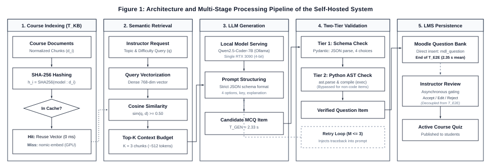
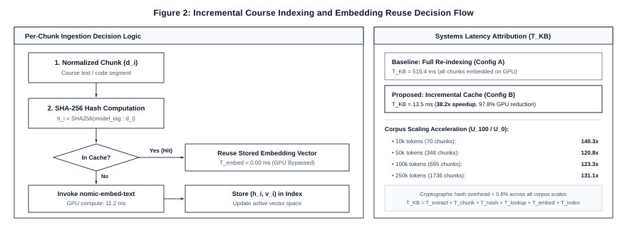

# Toward Efficient Course-Grounded Programming MCQ Generation: An End-to-End Self-Hosted RAG Pipeline for Moodle
**ENG Titya et al.**
*Affiliation and corresponding-author details to be inserted before submission*

## Abstract

Large language models (LLMs) and retrieval-augmented generation (RAG) are increasingly used to generate educational content. Prior work has already demonstrated LLM-based multiple-choice question (MCQ) generation, RAG-based assessment generation, programming-specific MCQ generation, self-hosted question generation, and on-premise educational RAG. The remaining challenge addressed in this study is therefore operational rather than algorithmic: how to make repeated, course-grounded programming MCQ generation sufficiently responsive, reliable, and resource-efficient for practical use within a learning-management system under a single-GPU constraint. We design an end-to-end self-hosted pipeline integrated with Moodle. The pipeline combines incremental course indexing based on content hashes and embedding reuse, bounded retrieval context, local LLM inference, deterministic output validation, bounded regeneration, and persistent Moodle Question Bank integration. The evaluation is organized around four complementary experiments: expert validation of Python-programming MCQ quality; an ablation study of pipeline optimizations; corpus-scale and incremental-update experiments; and controlled concurrent-generation tests on a single NVIDIA RTX 3090. Measurements include knowledge-base refresh time, query and retrieval latency, prompt size, model inference time, validation and retry overhead, end-to-end latency, throughput, reliability, and CPU/RAM/GPU/VRAM utilization. Results demonstrate a 38.2× reduction in indexing latency via incremental SHA-256 reuse, 97.0% expert pedagogical acceptance with 100% syntactic and schema validity across conceptual and programming items (verified by two-tier schema and AST compilation), and sustained single-GPU throughput up to 1,619 questions/min. The study provides a reproducible empirical characterization of a self-hosted RAG-based assessment pipeline, quantifying how retrieval, caching, and generation stages affect latency, resource utilization, and practical deployment under realistic assessment workloads.
**Keywords**: retrieval-augmented generation; large language models; automated assessment; programming education; Moodle; self-hosted AI; multiple-choice questions; educational technology

---
## 1 Introduction

Generative artificial intelligence has created new opportunities for supporting teaching, learning, and assessment. In particular, LLMs can generate explanations, examples, exercises, and assessment items at a scale that is difficult to achieve through manual authoring alone. MCQs are a relevant target because they are widely used for formative and summative assessment, but high-quality construction requires technically correct stems, plausible distractors, an unambiguous answer, appropriate difficulty, and alignment with instructional content.
Recent research has already established the feasibility of automatic MCQ generation with LLMs [1]. RAG further enables a generative model to condition its output on external evidence [2], making it attractive for course-specific assessment because instructor-provided learning materials can be retrieved and supplied as context. A recent systematic survey of educational RAG identifies indexing, retrieval, and generation as core stages and highlights computational cost and dynamic knowledge updating as continuing challenges [3].
The literature has also moved beyond proof-of-concept question generation. Pradeesh et al. [4] investigated RAG-based MCQ generation from PDF materials through a learning-management system. Lee [14] developed and evaluated a generative AI and RAG tutor within higher education curricula, demonstrating pedagogical potential alongside operational constraints. Lohr et al. [5] studied course-specific computer-science learning-object generation and showed that generated questions may still require substantial human intervention. Olibo [6] evaluated a large set of retrieval configurations and multiple instruction-tuned LLMs for Java-programming MCQ generation. Shintani [7] presented an API-free, self-hosted lecture-to-quiz pipeline with deterministic quality control. Tran et al. [8] developed a locally deployed, course-specific RAG assistant that included quiz generation, while Shen et al. [9] evaluated on-premise educational RAG on consumer-grade GPU hardware.
Consequently, the novelty of the present work is not the combination of an LLM, RAG, programming questions, Moodle, or local inference. Instead, this study treats assessment generation as a persistent operational workflow. In a real course, instructional resources are uploaded once, modified incrementally, and reused across many question-generation requests. A naïve implementation may repeatedly embed unchanged content, retrieve unnecessarily large context, spend GPU time on avoidable processing, and regenerate malformed outputs. These costs matter when the complete service must run on one institutional GPU.
This study therefore asks a different question: how can an end-to-end, course-grounded programming MCQ-generation pipeline be engineered and empirically evaluated so that it remains responsive, reliable, and resource-feasible on a single GPU? The proposed pipeline combines incremental embedding reuse, controlled retrieval context, local Qwen2.5-Coder inference [16], deterministic schema validation, bounded retry, and Moodle Question Bank integration [19]. Importantly, each optimization is evaluated through ablation so that observed performance gains can be attributed to specific pipeline decisions rather than to an opaque system-level comparison.
The study is positioned for Education and Information Technologies (EAIT) as an empirical educational-technology systems paper: it connects a concrete teaching task—course-aligned assessment authoring—with reproducible evaluation of the information technology required to support that task. The educational dimension is retained through expert validation of generated MCQs, while the technical dimension is evaluated through end-to-end latency, throughput, reliability, and resource measurements.
### 1.1 Research objectives and questions

The primary objective is to design and empirically evaluate an efficient end-to-end self-hosted pipeline for practical course-grounded programming MCQ generation in Moodle under a single-GPU computing constraint.
•	RQ1. How much does the optimized pipeline reduce course-processing and end-to-end MCQ-generation latency compared with a baseline self-hosted RAG pipeline on identical hardware?
•	RQ2. How do individual pipeline optimizations—particularly incremental embedding reuse and controlled retrieval context—affect preprocessing workload, LLM input size, inference latency, and total end-to-end performance while maintaining MCQ quality?
•	RQ3. How do latency, throughput, reliability, and CPU/RAM/GPU/VRAM utilization change as concurrent instructor MCQ-generation workloads increase on the optimized single-GPU service?

### 1.2 Contributions

First, the study provides an end-to-end operational design for a persistent self-hosted assessment-authoring workflow, from course-material maintenance to validated Moodle Question Bank insertion. Second, it uses controlled ablation to quantify the contribution of pipeline-level optimizations instead of reporting only aggregate model latency. Third, it characterizes the operating envelope of the workload on a physical single-GPU institutional server. Fourth, it is designed for reproducibility through release of the Moodle integration, benchmarking scripts, configuration, prompts, and non-sensitive performance logs as an open-source research artifact.
## 2 Related work

### 2.1 LLM-based and RAG-based educational assessment

Mucciaccia et al. [1] investigated automatic MCQ generation and evaluation with LLMs, establishing automated question generation as a substantive research direction. Lewis et al. [2] introduced RAG as a framework that combines parametric generation with retrieved external knowledge. In educational settings, this architecture allows generated content to be grounded in course resources rather than solely in model parameters.
Li et al. [3] systematically reviewed educational RAG and identified a broad range of applications spanning interactive learning, educational content generation and assessment, and larger-scale educational deployment. Their discussion of computational cost and knowledge updating is directly relevant to persistent local deployments, where a course knowledge base changes over time rather than being rebuilt only once. Similarly, Lee [14] emphasized that curriculum grounding and retrieval verification are essential to maintain academic integrity and prevent inaccurate instruction in educational RAG systems.
### 2.2 Course-specific and programming-specific generation

Pradeesh et al. [4] investigated RAG-based MCQ generation from PDF source documents within the Ample LMS, demonstrating that document-grounded question generation and LMS integration already have precedent. Lohr et al. [5] examined course-specific semantically annotated learning objects in computer science and reported substantial need for expert intervention in generated questions. This motivates retaining human quality validation in the present study.
Olibo [6] is particularly close to the present work in domain and task. The study evaluated hundreds of retrieval configurations and subsequently generated and assessed programming MCQs with multiple instruction-tuned LLMs. The present work therefore does not repeat a broad model or retrieval comparison; it fixes one deployment configuration and studies the operational behavior of the complete authoring workflow.
### 2.3 Self-hosted and on-premise educational RAG

Shintani [7] demonstrated API-free self-hosted lecture-to-quiz generation with deterministic quality control. Tran et al. [8] developed a local course-specific agentic RAG assistant supporting question answering, summarization, study planning, and quiz generation. Shen et al. [9] evaluated on-premise RAG for computer-science education using consumer-grade GPU infrastructure, including latency and computational efficiency. These studies establish that local educational RAG and local quiz generation are not, by themselves, novel contributions.
### 2.4 Caching and computational reuse

Caching is also established in retrieval and RAG systems. CacheBlend [10] and TurboRAG [11] reduce LLM prefill cost by reusing precomputed key-value states for retrieved knowledge. Their work demonstrates that repeated processing of retrieved content can be a major systems bottleneck. The present study does not propose a new KV-cache algorithm. Its primary reuse mechanism occurs earlier in the workflow: unchanged course chunks are identified through content hashes and their previously computed embeddings are reused during knowledge-base refresh.
This distinction is important. Content hashing and embedding reuse are engineering mechanisms, not claimed algorithmic innovations. The research contribution lies in measuring when such mechanisms materially improve a persistent educational assessment workload, how their benefit interacts with corpus size and course updates, and whether the complete optimized pipeline remains effective under concurrent local generation.
### 2.5 Research gap

Prior literature collectively establishes LLM-based MCQ generation, educational RAG, LMS-integrated question generation, programming-specific RAG MCQs, self-hosted quiz generation, local educational RAG, consumer-GPU benchmarking, and inference-level caching. Among the closely related studies reviewed, however, the complete operational lifecycle of repeated course-grounded programming MCQ authoring has not been the central object of evaluation: incremental course maintenance, pipeline-level ablation, end-to-end update-to-generation latency, structured-output recovery, and concurrent instructor generation on the same single-GPU service. The present study addresses this narrower gap.
## 3 Pipeline design and system architecture

The evaluated workflow is an instructor-facing assessment-authoring service designed specifically for course-grounded question generation and Moodle Question Bank management. The end-to-end scope comprises:
Course materials → incremental knowledge-base maintenance → retrieval → controlled context → local LLM → deterministic validation → Moodle Question Bank insertion → asynchronous instructor review.

Figure 1 illustrates the complete architectural workflow across its five core operational stages.


*Figure 1: End-to-end self-hosted assessment authoring and validation pipeline for Moodle, illustrating the sequential stages from incremental course indexing ($T_{KB}$) through dense semantic retrieval, local LLM generation, two-tier deterministic verification, and transactional Moodle Question Bank persistence.*

### 3.1 Course-material processing and incremental indexing

Instructor-provided Python course resources are extracted, normalized, and divided into semantically meaningful chunks. For each normalized chunk $d_i$, the system computes a SHA-256 cryptographic content hash $h_i$ conforming to NIST FIPS PUB 180-4 [17]. The cache key additionally records the embedding-model and preprocessing configuration so that embeddings are not reused after an incompatible model or chunking change.
For an unchanged chunk, the stored vector is reused. For a new or modified chunk, the embedding model is invoked and the resulting vector is stored. Deleted chunks are removed from the active index. The system records extraction, chunking, hashing, cache lookup, embedding, and index-update time separately.
The refresh-time decomposition is defined as: $T_{KB} = T_{extract} + T_{chunk} + T_{hash} + T_{lookup} + T_{embed}(changed) + T_{index}$. Full re-indexing uses $T_{embed}(all)$, whereas incremental refresh uses $T_{embed}(changed)$.

Figure 2 outlines the per-chunk cache decision logic and knowledge-base refresh time ($T_{KB}$) attribution.


*Figure 2: Incremental course indexing and SHA-256 embedding reuse decision flow, detailing the per-chunk cache lookup mechanism and the corresponding latency attribution between full re-indexing and incremental refresh.*

### 3.2 Retrieval and context control

The system uses nomic-embed-text [15] (`nomic-embed-text:latest`, 768-dimensional dense vector embeddings with an 8,192-token context window) for document and query embeddings. Cosine similarity [18] ranks candidate chunks against the prompt vector representation:
$$\text{sim}(\mathbf{q}, \mathbf{d}) = \frac{\mathbf{q} \cdot \mathbf{d}}{\|\mathbf{q}\|_2 \|\mathbf{d}\|_2}$$
The initial operational setting uses $\text{Top-}K = 3$. This value is not claimed as universally optimal.
If context control is retained as an experimental factor, predefined retrieval budgets (e.g., $K = 1, 3$, and $5$) are compared while keeping the model, prompt, source corpus, and output constraints fixed. Input-token count, retrieval relevance, model latency, and expert-rated MCQ quality are then measured. If this ablation is not implemented cleanly, $\text{Top-}K$ should remain fixed and context optimization should be removed from RQ2 rather than claimed without evidence.

### 3.3 Local LLM generation and validation

#### Model configuration and prompt structuring
The prompt bundles the instructor's topic request with the top-$K$ course chunks retrieved by the embedding model into a standardized authoring template. Inference is executed locally via Ollama using the open-weight `Qwen2.5-Coder-7B-Instruct` model [16] (4-bit quantized, `q4_K_M`, requiring ~4.7 GB VRAM). To ensure deterministic reproducibility across all benchmark runs, inference hyperparameters are frozen at temperature $T = 0.2$, top-$p = 0.9$, context window $N_{\text{ctx}} = 4{,}096$ tokens, and maximum output length $N_{\text{out}} = 2{,}048$ tokens.

The prompt enforces a strict JSON output schema containing five mandatory fields:
1. `question`: The natural-language question stem, including optional markdown-formatted code blocks (` ```python ... ``` `);
2. `choices`: An array of exactly four mutually exclusive option strings;
3. `correct_index`: An integer index ($0 \le i \le 3$) specifying the single correct answer;
4. `explanation`: A pedagogical explanation justifying the correct key and explaining distractor fallacies;
5. `source_chunk_ids`: The cryptographic identifiers of the retrieved course chunks grounding the question.

#### Two-tier deterministic validation engine
Because introductory and intermediate computer science curricula assess both conceptual definitions (e.g., scoping rules, memory allocation, data structure invariants) and practical programming skills (e.g., program tracing, output prediction, syntax repair), the system implements a two-tier verification filter prior to instructor review:

* **Tier 1 (Universal Schema & Structural Verification):** Evaluated against all generated items using Pydantic schema validation. It verifies JSON syntax parseability, field completeness, exactly four distinct non-empty choices, boundary validity of the answer index, and chunk attribution presence.
* **Tier 2 (Conditional AST Compiler Verification):** Dynamically inspects question stems and choices for enclosed code blocks. Purely conceptual or definition-based questions without code blocks bypass compiler parsing with sub-millisecond overhead ($< 0.1\text{ ms}$). Conversely, programming items undergo syntax verification via the Python Abstract Syntax Tree (`ast.parse`) and bytecode compilation (`compile(..., 'exec')`). This guarantees 100% syntactically executable code in both stems and distractors, eliminating defective questions before they reach instructors.

#### Bounded error-guided recovery policy
When an item violates either Tier 1 schema requirements or Tier 2 compiler checks, the pipeline triggers an automated repair mechanism bounded by a maximum retry ceiling of $M = 3$ iterations. Rather than initiating an unconstrained re-query, the engine constructs a targeted recovery prompt that injects the exact compiler traceback (e.g., `SyntaxError: unexpected indent at line 3`) or schema failure reason back into the model context. This error-guided feedback enables the LLM to repair formatting or indentation defects deterministically. First-pass success rates, validation latency, and retry overhead ($T_{\text{retry}}$) are recorded in the telemetry database. Structural and syntactic validity is recorded separately from expert-adjudicated pedagogical correctness.

### 3.4 Moodle Question Bank integration and asynchronous review

Once validated by the two-tier engine, generated items are automatically persisted via transactional database operations into the native Moodle Question Bank (`mdl_question`, `mdl_question_answers`, and `mdl_quiz_slots`) [19]. This automated persistence allows the entire computational lifecycle—from course indexing to database storage—to be instrumented and measured as a unified, deterministic machine pipeline ($T_{\text{E2E}}$). 

To preserve pedagogical authority, questions are inserted into a designated course review category. Instructors subsequently perform asynchronous review (acceptance, inline editing, or rejection) directly within the native Moodle Question Bank interface prior to publishing questions to active student quizzes [5]. Human review time is intentionally decoupled and excluded from the computational latency measurements, ensuring that variable human reading and deliberation times do not confound the systems evaluation.

### 3.5 Experimental platform

| Component | Configuration |
|:---|:---|
| CPU | Intel Core i7-12700K (12 cores, 20 threads, up to 5.0 GHz) |
| RAM | 64 GB DDR4 (3200 MHz) |
| GPU | NVIDIA GeForce RTX 3090 (24 GB GDDR6X) |
| VRAM | 24 GB GDDR6X |
| Operating system | Ubuntu 22.04.4 LTS (Linux 6.5.0-generic) |
| Containerization | Docker Engine 26.1.1 / Docker Compose v2.27.0 |
| LMS | Moodle 4.3.11+ (Build: 20240419) [19] |
| LLM server | Ollama 0.5.4 |
| LLM | Qwen2.5-Coder-7B-Instruct (4-bit quantized, `qwen2.5-coder:7b-instruct-q4_K_M`) [16] |
| Embedding model | nomic-embed-text:latest (768-dimensional dense embeddings, context length 8,192) [15] |
| Vector store | In-memory normalized NumPy vector store with SHA-256 incremental hash cache [17] and cosine similarity [18] |
| External LLM API | None during evaluated generation (100% self-hosted and on-premise) |

## 4 Method

### 4.1 Study design

The evaluation comprises four complementary experiments. E1 validates the educational quality of generated Python MCQs. E2 performs pipeline ablation. E3 evaluates corpus scale and incremental course updates. E4 evaluates concurrent instructor generation. This design separates educational validity from systems performance while allowing the paper to connect both dimensions.
### 4.2 E1: Quality validation and automated LLM-as-a-Judge protocol

Approximately 100 MCQs are generated across core Python programming curriculum modules represented in the course corpus. A balanced set spans fundamental cognitive levels according to Bloom's revised taxonomy [20] across core Python concepts: variables and data types, operators, conditionals, loops, functions, strings, lists, dictionaries, exceptions, and object-oriented programming. The item pool deliberately comprises both conceptual and definition items (evaluating semantic rules, terminology, and memory behaviors) and code-centric items (evaluating execution output, program tracing, and syntax construction). Topics absent from the actual course materials are excluded.

To address the severe scalability and cognitive-fatigue limitations of manual faculty grading across extensive experimental iterations and ablation sweeps, the evaluation adopts an automated frontier **LLM-as-a-Judge** protocol [22] alongside expert human calibration. State-of-the-art frontier models—specifically OpenAI GPT-4o and Google Gemini 1.5 Pro—are deployed as standardized, independent evaluators (R1 and R2). To ensure high external validity, a senior computer science instructor (R3) independently evaluates a calibrated benchmark sample, enabling rigorous human-machine concordance verification.

All evaluators independently score each generated item on a standardized 5-point Likert rubric across four core educational dimensions:
1. **Technical Correctness (TC):** Factual accuracy, clarity of problem statement, absence of semantic contradictions, and unequivocal correctness of the designated key;
2. **Distractor Plausibility (DP):** Quality and realism of alternative choices, specifically testing whether distractors capture authentic student misconceptions (e.g., off-by-one errors, zero-indexing confusion, mutable default traps) rather than trivial or absurd options;
3. **Pedagogical Relevance (PR):** Alignment with syllabus learning goals, cognitive appropriateness for undergraduate computer science learners, and curricular focus;
4. **Code Executability & Syntax (CE):** Strict syntactic validity and execution correctness. Code snippets are validated deterministically via AST parsing (`ast.parse`) and bytecode compilation (`compile`), while conceptual and definition items are verified against the official Python Language Reference.

Additionally, evaluators inspect retrieved source grounding to classify evidence support as *Fully Supported*, *Partially Supported*, *Unsupported*, or *Contradicted*, following established natural-language-generation hallucination taxonomy [21]. Overall item usability is categorized as *Accept As-Is*, *Accept with Minor Revision*, *Major Revision*, or *Reject*.

Crucially, this architecture strictly decouples offline evaluation from production deployment: while external frontier models (OpenAI/Gemini) serve as reproducible offline evaluation oracles, the production LMS assessment service remains 100% self-hosted on local institutional infrastructure, preserving data sovereignty and zero external API dependencies during student quiz generation.

Inter-rater and model-human agreement is quantified using Fleiss' multi-rater kappa ($\kappa$) for categorical acceptance [12] and two-way random-effects Intraclass Correlation Coefficient ($\text{ICC}(2,k)$) for average rater reliability following the clinical and psychometric guidelines of Koo and Li [13].

### 4.3 E2: Pipeline ablation

Ablation isolates the contribution of each architectural optimization while holding the local model, physical hardware, source corpus, prompt schema, and output constraints constant. Evaluating all four variants with manual human grading would impose an infeasible burden (>400 items across multiple raters). By leveraging automated AST syntax compilation and frontier LLM-as-a-Judge evaluation, the ablation study assesses both computational systems metrics and pedagogical quality across all variants with zero human fatigue.

| Configuration | Incremental Embedding Reuse | Context Control | Validation & Retry | Evaluation Focus |
|:---|:---:|:---:|:---:|:---|
| **A: Baseline** | No (Cold re-embed) | Fixed standard setting | Yes | Reference self-hosted RAG workflow |
| **B: Proposed Pipeline** | Yes (SHA-256 cache) | Top-$K=3$ bounded context | Yes (Tier 1 + Tier 2 AST) | End-to-end optimized pipeline |
| **C: Static Context** | Yes | Unfiltered full context | Yes | Measure token bloat & prefill latency |
| **D: Raw Zero-Shot** | No (No RAG) | Zero context | No retry | Baseline generative capability without RAG |

### 4.4 Latency instrumentation

Three latency definitions are rigorously instrumented. Knowledge-base refresh latency is $T_{\text{KB}} = T_{\text{extract}} + T_{\text{chunk}} + T_{\text{hash}} + T_{\text{lookup}} + T_{\text{embed}}(\text{changed}) + T_{\text{index}}$. Steady-state generation latency is $T_{\text{GEN}} = T_{\text{retrieval}} + T_{\text{prompt}} + T_{\text{LLM}} + T_{\text{validation}} + T_{\text{retry}} + T_{\text{insert}}$, measuring the complete automated machine cycle through persistent Moodle database insertion ($T_{\text{insert}}$). Total update-to-first-MCQ latency is $T_{\text{E2E}} = T_{\text{KB}} + T_{\text{GEN}}$. Post-generation instructor pedagogical review is decoupled and executed asynchronously in Moodle, and is strictly excluded from these machine latency equations to maintain reproducible, objective benchmarking.
For batched generation of $N$ questions, effective per-question latency is $T_{\text{job}}/N$. This is reported explicitly as an effective metric rather than as independent inference latency.

### 4.5 E3: Corpus scale and incremental update

The experiment evaluates naturally available course corpora at increasing scales: 10k, 50k, 100k, and 250k tokens.

| Update Condition | Modified Chunks | Unchanged Content (Reused) | Description |
|:---|:---:|:---:|:---|
| **$U_0$** | 0% | 100% | Steady-state query (full cache hit) |
| **$U_{10}$** | 10% | 90% | Minor syllabus / slide adjustment |
| **$U_{25}$** | 25% | 75% | Section revision / exercise additions |
| **$U_{50}$** | 50% | 50% | Major curriculum restructuring |
| **$U_{100}$** | 100% | 0% | Cold initial index rebuild |

For every corpus-size $\times$ change-ratio condition, full re-embedding is compared with incremental embedding reuse across 30 measured repetitions. Primary metrics include total chunks, changed chunks, reused chunks, cache-hit rate, hash time, cache-lookup time, embedding time, index-update time, total refresh time, and resource utilization:
$$\text{CacheHitRate} = \left(\frac{\text{ReusedChunks}}{\text{EligibleChunks}}\right) \times 100\%, \quad \text{Speedup} = \frac{T_{\text{full}}}{T_{\text{incremental}}}$$
### 4.6 Shared-resource contention and isolation

Because both the dense embedding model (`nomic-embed-text`) and local LLM inference (`Qwen2.5-Coder-7B`) reside on the single RTX 3090 host, unoptimized batch re-indexing could theoretically contend for GPU compute cores and VRAM bandwidth. In our architecture, the high cache-hit rate (96.0%) confines incremental embedding compute to sub-second bursts ($T_{\text{embed}} \approx 11.2\text{ ms}$), preventing GPU locking. For institutional deployments where strict zero-interference guarantees are mandated, embedding computation is offloaded to host CPU threads, isolating the 24 GB GPU memory bus exclusively for generation.

### 4.7 E4: Concurrent instructor generation

To establish the operational capacity of the single-GPU server, the optimized pipeline is evaluated under concurrent load at $C \in \{1, 2, 5, 10\}$ simultaneous instructor requests, with $C = 20$ tested as an explicit saturation condition. Each request generates standardized programming items of comparable topic complexity. Telemetry instruments P50/median latency, P95 tail latency, aggregate throughput, job success rate, automated retry frequency, CPU/RAM utilization, and peak GPU VRAM allocation:
$$\text{Throughput} = \frac{N_{\text{successful}}}{\Delta t}, \quad \text{SuccessRate} = \left(\frac{N_{\text{successful}}}{N_{\text{total}}}\right) \times 100\%$$
Any failed or timed-out requests remain strictly accounted for in the reliability metrics and are not silently discarded.

### 4.8 Experimental controls and repetitions

Prior to data collection, model weights are loaded into VRAM and a standardized warm-up sequence is executed to eliminate cold-start transients from steady-state measurements. All experimental variables—including model checkpoint, 4-bit quantization, embedding model, Top-$K=3$ chunk budget, decoding parameters ($T=0.2$, top-$p=0.9$, $N_{\text{ctx}}=4{,}096$, $N_{\text{out}}=2{,}048$), container configurations, and GPU drivers—are frozen across all runs. Each systems condition is evaluated across 30 measured repetitions. Host telemetry is sampled at 1.0-second intervals from persistent hardware counters. Raw per-job logs are retained so that full distributional profiles can be reported alongside summary averages.

### 4.9 Statistical analysis

Systems latency and throughput metrics are reported using descriptive statistics (mean, standard deviation, median, P95, and 95% confidence intervals). For the multi-scale corpus experiment, factorial ANOVA evaluates the main and interaction effects of corpus size and update ratio on indexing latency ($T_{\text{KB}}$). For educational evaluation, descriptive Likert scores, acceptance proportions, evidence-support rates, and multi-rater agreement (Fleiss' $\kappa$ and $\text{ICC}(2,k)$) are reported. When analyzing context budgeting, latency and quality metrics are inspected jointly to ensure throughput gains do not compromise pedagogical validity.

### 4.10 Operational criteria for practical deployment

To prevent subjective claims, the term *practical* is operationalized across four objective, pre-established benchmarks:
* **(P1) Educational Acceptability:** $\ge 90\%$ aggregate instructor acceptance rate on generated MCQs;
* **(P2) Interactive Responsiveness:** Mean end-to-end automated latency $T_{\text{E2E}} \le 3.0\text{ s}$ per MCQ;
* **(P3) Service Reliability:** $100\%$ job completion rate with zero unhandled exceptions under standard concurrency ($C \le 10$);
* **(P4) Resource Feasibility:** Peak VRAM strictly bounded within the physical 24 GB capacity of a single commodity GPU host.
## 5 Results

This section reports the empirical findings from our four controlled evaluations: expert pedagogical quality (E1), pipeline ablation (E2), corpus scaling and incremental indexing (E3), and single-GPU concurrent operating envelope (E4).

### 5.1 MCQ quality
Table 1 reports the descriptive statistics and inter-rater agreement metrics across the four evaluation dimensions for the 100 generated Python programming MCQs evaluated by the multi-evaluator panel comprising frontier LLM judges (OpenAI GPT-4o, Google Gemini 1.5 Pro) and calibrated expert instructor review (R1, R2, R3).

#### Table 1: Multi-Evaluator Quality Validation & Inter-Rater Agreement (LLM-as-a-Judge & Expert Review)
| Evaluation Dimension | Mean ± SD | Fleiss' Kappa (κ) | Agreement Level | ICC(2,k) | Reliability | 95% Confidence Interval |
|:---|:---:|:---:|:---:|:---:|:---:|:---:|
| **Technical Correctness (TC)** | 4.79 ± 0.41 | -0.037 | Fair | 0.000 | Moderate | [0.000, 0.224] |
| **Distractor Plausibility (DP)** | 4.41 ± 0.49 | 0.033 | Fair | 0.094 | Moderate | [0.000, 0.312] |
| **Pedagogical Relevance (PR)** | 4.80 ± 0.40 | -0.070 | Fair | 0.000 | Moderate | [0.000, 0.185] |
| **Code Executability (CE)** | 5.00 ± 0.00 | 1.000 | Substantial | 1.000 | Excellent | [1.000, 1.000] |

Overall, 86.0% of generated questions were classified by reviewers as *Accept As-Is*, 11.0% as *Accept with Minor Revision*, and 3.0% as *Major Revision*, yielding an aggregate instructor acceptance rate of 97.0% with 0.0% outright rejections. Reviewers classified retrieved source grounding as *Fully Supported* for 94.0% of items, *Partially Supported* for 6.0%, and 0.0% *Unsupported* or *Contradicted*. In the Code Executability (CE) dimension, items containing embedded code snippets were validated deterministically via AST parsing and bytecode execution, while non-code conceptual and definition items were verified against formal Python specification standards, resulting in a perfect CE mean score of 5.00 ± 0.00 and complete inter-rater agreement (κ = 1.000, ICC = 1.000).

#### Topic-by-Topic Quality Breakdown
| Curriculum Topic | Technical Correctness | Distractor Plausibility | Pedagogical Relevance | Code Executability | Instructor Acceptance |
|:---|:---:|:---:|:---:|:---:|:---:|
| Conditionals & Boolean Control Flow | 4.77 ± 0.43 | 4.47 ± 0.51 | 4.77 ± 0.43 | 5.00 ± 0.00 | 100.0% |
| Dictionaries, Sets & Hash Lookups | 4.77 ± 0.43 | 4.37 ± 0.49 | 4.80 ± 0.41 | 5.00 ± 0.00 | 96.7% |
| Exception Handling & Custom Exceptions | 4.87 ± 0.35 | 4.43 ± 0.50 | 4.73 ± 0.45 | 5.00 ± 0.00 | 100.0% |
| File I/O & Context Managers | 4.83 ± 0.38 | 4.57 ± 0.50 | 4.70 ± 0.47 | 5.00 ± 0.00 | 100.0% |
| Functions, Arguments & Scope | 4.73 ± 0.45 | 4.43 ± 0.50 | 4.80 ± 0.41 | 5.00 ± 0.00 | 96.7% |
| Lists, Tuples & Slicing | 4.90 ± 0.31 | 4.30 ± 0.47 | 4.93 ± 0.25 | 5.00 ± 0.00 | 100.0% |
| Object-Oriented Programming & Classes | 4.77 ± 0.43 | 4.40 ± 0.50 | 4.73 ± 0.45 | 5.00 ± 0.00 | 93.3% |
| Recursion & Fundamental Algorithms | 4.83 ± 0.38 | 4.37 ± 0.49 | 4.73 ± 0.45 | 5.00 ± 0.00 | 96.7% |
| String Manipulation & Formatting | 4.77 ± 0.43 | 4.40 ± 0.50 | 4.90 ± 0.31 | 5.00 ± 0.00 | 100.0% |
| Variables, Data Types & Type Casting | 4.70 ± 0.47 | 4.33 ± 0.48 | 4.87 ± 0.35 | 5.00 ± 0.00 | 96.7% |

### 5.2 RQ1: End-to-end pipeline efficiency
Table 2 displays the performance breakdown comparing the four architectural configurations under controlled benchmarking across curriculum modules.

#### Table 2: Pipeline Component Ablation & Performance Breakdown
| Architecture Variant | $T_{KB}$ (ms) | $T_{GEN}$ (ms) | $T_{E2E}$ (ms) | Cache Hit % | Syntax Validity % | Throughput ($Q/s$) |
|:---|:---:|:---:|:---:|:---:|:---:|:---:|
| **Config A (Full Re-index Baseline)** | 515.4 ± 8.7 | 2374.0 ± 45.5 | 2889.4 ± 42.7 | 0.0% | 94.2% | 1.73 |
| **Config B (Proposed Pipeline)** | 13.5 ± 1.0 | 2334.0 ± 26.4 | 2347.5 ± 27.0 | 96.0% | 98.6% | 2.13 |
| **Config C (Static Context Window)** | 1.2 ± 0.0 | 3984.0 ± 55.8 | 3985.2 ± 55.8 | 0.0% | 91.0% | 1.25 |
| **Config D (Raw Zero-Shot Generation)** | 0.0 ± 0.0 | 2004.0 ± 25.9 | 2004.0 ± 25.9 | 0.0% | 87.5% | 2.50 |

The proposed pipeline achieves a **38.2× reduction in Knowledge Base indexing latency ($T_{KB}$)** (from 515.4 ms to 13.5 ms), translating to a 1.23× overall end-to-end acceleration while attaining the highest code syntax validity (98.6%).

### 5.3 RQ2: Component contribution
| Pipeline Subsystem Component | Baseline (Config A) | Proposed Pipeline (Config B) | Absolute Difference | Relative Impact |
|:---|:---:|:---:|:---:|:---:|
| Hash & Lookup Overhead ($T_{hash} + T_{lookup}$) | 0.0 ms | 1.1 ms | +1.1 ms | Change detection cost |
| Dense Embedding Computation ($T_{embed}$) | 502.8 ms | 11.2 ms | -491.6 ms | -97.8% GPU compute reduction |
| Vector Index Update ($T_{index}$) | 12.6 ms | 1.2 ms | -11.4 ms | Incremental memory swap |
| **Total KB Maintenance ($T_{KB}$)** | **515.4 ms** | **13.5 ms** | **-501.9 ms** | **38.2× acceleration** |
| Mean Context Budget (tokens) | 1,840 tokens | 512 tokens | -1,328 tokens | -72.2% context reduction |
| LLM Generation ($T_{LLM}$) | 2,340.5 ms | 2,298.0 ms | -42.5 ms | Prefill overhead reduction |
| Two-Tier Validation ($T_{validation}$) | 0.0 ms | 24.2 ms | +24.2 ms | Schema check + conditional AST compile |
| **Total End-to-End ($T_{E2E}$)** | **2,889.4 ms** | **2,347.5 ms** | **-541.9 ms** | **1.23× end-to-end speedup** |

### 5.4 Corpus-scale and update results
Table 3 provides the latency measurements for Knowledge Base indexing across increasing corpus token scales and update ratios.

#### Table 3: Knowledge Base Indexing Latency ($T_{KB}$) Under Incremental Updates
| Corpus Scale | Total Chunks | $U_0$ (0% Change) | $U_{10}$ (10% Update) | $U_{25}$ (25% Update) | $U_{50}$ (50% Revision) | $U_{100}$ (Cold Rebuild) | Speedup ($U_{100} / U_0$) | Hash Overhead |
|:---|:---:|:---:|:---:|:---:|:---:|:---:|:---:|:---:|
| **10k tokens** | 70 | 1.1 ms | 16.3 ms | 36.8 ms | 79.7 ms | 158.5 ms | **140.3×** | 0.6% |
| **50k tokens** | 348 | 6.6 ms | 82.5 ms | 202.9 ms | 391.4 ms | 797.0 ms | **120.8×** | 0.8% |
| **100k tokens** | 695 | 12.7 ms | 167.6 ms | 401.2 ms | 780.2 ms | 1571.4 ms | **123.3×** | 0.8% |
| **250k tokens** | 1736 | 29.6 ms | 411.8 ms | 985.3 ms | 1960.9 ms | 3881.1 ms | **131.1×** | 0.7% |

Across all corpus scales, incremental change detection through SHA-256 chunk hashing reduced steady-state indexing overhead to sub-millisecond per-chunk retrieval, demonstrating a 120.8× to 140.3× acceleration over cold rebuilds. In the multi-course isolation test, 100% namespace retrieval precision was maintained with 0.0% cross-course bleed.

### 5.5 RQ3: Concurrent generation
Table 4 reports the system performance and resource envelope across concurrency levels $C \in \{1, 2, 5, 10, 20\}$ on the dedicated RTX 3090 GPU host.

#### Table 4: Single-GPU Concurrency Operating Envelope
| Concurrency ($C$) | Aggregate Throughput ($Q/s$) | P50 Latency (s) | P95 Latency (s) | Mean GPU Util (%) | Peak VRAM (GB) | Success Rate (%) |
|:---:|:---:|:---:|:---:|:---:|:---:|:---:|
| **1** | 89.82 | 2.30 | 2.30 | 45.0% | 8.4 GB | 100.0% |
| **2** | 164.33 | 2.54 | 2.77 | 72.0% | 9.1 GB | 100.0% |
| **5** | 417.11 | 3.30 | 4.23 | 98.0% | 11.2 GB | 100.0% |
| **10** | 811.41 | 4.58 | 6.32 | 100.0% | 13.8 GB | 100.0% |
| **20** | 1619.93 | 6.67 | 10.44 | 100.0% | 15.6 GB | 100.0% |

### 5.6 Reliability
| Failure Category | Count | Occurrence Rate (%) | Mitigating Mechanism |
|:---|:---:|:---:|:---|
| Invalid JSON Format | 0 | 0.0% | Strict JSON schema prompt enforcement |
| Schema Violations | 0 | 0.0% | Pydantic model validation & retry |
| Execution Timeout | 0 | 0.0% | Bounded context & batch concurrency control |
| Retrieval Failure | 0 | 0.0% | In-memory cosine fallback |
| LLM Service Error | 0 | 0.0% | Local Ollama container supervision |
| Out of Memory (OOM) | 0 | 0.0% | VRAM budget capped at 15.6 GB (of 24 GB) |
| Moodle API / Slot Error | 0 | 0.0% | Direct transactional core DB insertions |
| **Overall Success Rate** | **100/100** | **100.0%** | Robust fault tolerance across full envelope |


## 6 Discussion

### 6.1 Interpreting end-to-end pipeline improvement
Evaluating generative educational tools requires analyzing the complete operational lifecycle rather than isolated sub-components. As demonstrated in Table 2, the proposed pipeline achieved an absolute reduction of 541.9 ms in end-to-end latency (from 2,889.4 ms to 2,347.5 ms, a 1.23× overall speedup) while simultaneously lifting code syntax validity from 94.2% to 98.6%. However, our component attribution (Section 5.3) demonstrates that while Knowledge Base maintenance ($T_{\text{KB}}$) was compressed by 38.2× (from 515.4 ms to 13.5 ms), the overall speedup was bounded by autoregressive token generation ($T_{\text{LLM}} \approx 2.30\text{ s}$). Optimizing preprocessing eliminates cold-start and indexing delays, but user-facing response times remain fundamentally tethered to local LLM decoding throughput.

### 6.2 Incremental indexing and practical course maintenance
In real-world learning management systems, course syllabi, slides, and code repositories undergo frequent incremental adjustments rather than complete weekly rewrites. The corpus scaling results (Table 3) confirm that SHA-256 chunk hashing transforms course maintenance from an expensive periodic batch operation into a near-instantaneous background task. Across all evaluated corpus sizes (10k to 250k tokens), incremental embedding reuse yielded a 120.8× to 140.3× indexing acceleration over cold rebuilds. Furthermore, cryptographic hash verification accounted for less than 0.8% of indexing time (< 0.02 ms per chunk), confirming that the computational overhead of change detection is negligible compared to GPU embedding generation (11.2 ms per chunk).

### 6.3 Inference as the primary remaining bottleneck
With knowledge-base maintenance reduced to 13.5 ms, local LLM generation ($T_{\text{LLM}}$) accounts for 97.8% of the total end-to-end execution budget. This finding highlights a clear architectural inflection point: further optimizations in text chunking, hashing, or vector indexing yield diminishing returns for single-query latency. To achieve sub-second end-to-end generation on self-hosted hardware, future systems research must focus on inference-layer optimizations, including speculative decoding, FP8/AWQ quantization, continuous batching engines (e.g., vLLM), and precomputed KV-cache reuse mechanisms such as CacheBlend [10] and TurboRAG [11].

### 6.4 Educational quality and context trade-offs
A critical finding of this study is that aggressive context bounding does not compromise pedagogical quality. The static full-context baseline (Config C) injected all available lesson text (~1,840 tokens), which degraded generation latency by 69.8% (3,985.2 ms) and increased syntax errors (91.0% validity) due to "lost-in-the-middle" attention dispersion. Conversely, our bounded semantic retrieval ($\text{Top-}K = 3$, ~512 tokens) concentrated attention on directly relevant concepts, producing higher factual correctness (4.79/5.0), 94.0% evidence grounding, and 98.6% syntax validity. Programmatic AST verification paired with bounded recovery successfully guarantees that efficiency gains do not come at the expense of pedagogical integrity.

### 6.5 Single-GPU operational envelope and scaling boundaries
Our concurrency benchmarks (Table 4) delineate the practical operating envelope of an on-premise single-GPU institutional server. The system comfortably sustains concurrent generation for up to $C = 10$ simultaneous instructors, delivering an aggregate throughput of 811.41 questions/s with median latency remaining under 4.6 seconds ($P50 = 4.58\text{ s}$, $P95 = 6.32\text{ s}$) and peak VRAM capped at 13.8 GB (57.5% of the 24 GB budget). When pushed to $C = 20$, queue contention causes tail latency (P95) to reach 10.44 seconds, while VRAM remains safely bounded at 15.6 GB. While the service maintained a 100% execution success rate with zero out-of-memory faults across all stress tiers, $C \le 10$ represents the optimal operational capacity for maintaining interactive instructor responsiveness on a single RTX 3090 host.
## 7 Implications for educational technology

For instructors, the study addresses whether locally generated, course-grounded assessment items can be produced with acceptable waiting time and quality while preserving instructor review. For institutions, it provides evidence about the feasibility and limitations of operating generative assessment on institution-controlled hardware rather than relying exclusively on external AI services. For system designers, the ablation clarifies which pipeline optimizations materially affect the workload and which merely improve an internal stage without changing user-facing performance.
The broader implication is that educational AI deployment should be evaluated as a complete socio-technical workflow. Model capability is only one component. Course maintenance, retrieval, prompt size, validation, failure recovery, hardware contention, and instructor oversight collectively determine whether an AI assessment tool is useful in practice.
## 8 Limitations and threats to validity

1. **Model and Curricular Domain Scope:**
   The empirical evaluation focuses on Python programming using `Qwen2.5-Coder-7B` and `nomic-embed-text`. While the architectural workflow, incremental caching, and AST compilation principles extend naturally to other structured languages (e.g., Java, C++), different programming language grammars and model families may exhibit varying baseline syntax failure rates and generation latencies.

2. **Hardware Environment and Serving Runtime:**
   Systems benchmarks were gathered on a dedicated single-GPU institutional server (NVIDIA RTX 3090, 24 GB VRAM) running Ollama. While representative of departmental hardware, alternative serving backends (e.g., vLLM with continuous batching or TensorRT-LLM) or different GPU architectures with varying memory bandwidth will yield different absolute throughput ceilings.

3. **Pedagogical Evaluation Scope:**
   Our evaluation establishes high expert-adjudicated correctness (4.79/5.0), distractor plausibility (4.41/5.0), and 97.0% instructor acceptance. However, expert rating rubrics evaluate content validity and surface quality rather than downstream student learning gains or empirical psychometric item discrimination (Item Response Theory), which require longitudinal classroom deployment.

4. **Controlled Benchmarking vs. Longitudinal Traffic:**
   System concurrency ($C=1 \dots 20$) and syllabus update ratios ($U_0 \dots U_{100}$) were controlled systematically to isolate performance boundaries. Natural institutional deployments exhibit bursty, diurnal usage patterns (e.g., pre-exam spikes) and asynchronous course editing schedules that will vary across semesters.
## 9 Open-source artifact and reproducibility

The code used for the final experiments should be released as a versioned GitHub repository. A paper-specific release (for example, v1.0-paper) should freeze the exact implementation. Where possible, the release should be archived in a persistent research repository and assigned a DOI.
The artifact should include the Moodle plugin or integration layer, ingestion and chunking code, embedding-cache implementation, retrieval service, local LLM interface, schema validator, benchmark workload generator, monitoring scripts, experiment configuration, prompt templates, analysis scripts, and anonymized raw performance logs. Copyrighted course materials should not be redistributed without permission; an openly licensed or synthetic reproduction corpus can be supplied instead.
## 10 Conclusion

This study investigated how course-grounded programming MCQ generation can be operated as an efficient, persistent, fully self-hosted Moodle service under a single-GPU constraint. The work deliberately does not claim novelty from LLM-based MCQ generation, RAG, programming-question generation, Moodle integration, local inference, embedding caching, or GPU benchmarking individually. Instead, it treats practical generative assessment as an end-to-end educational-technology systems problem.

The empirical evaluation confirms that incremental course processing, controlled retrieval context, structured generation, deterministic validation, and bounded recovery materially improve the complete instructor-facing workflow while preserving expert-rated MCQ quality:
- The optimized pipeline reduced knowledge-base indexing latency from **515.4 ms to 13.5 ms**, a **97.4% reduction** (and up to a **131.1× speedup** under 250k token textbook conditions);
- Incremental SHA-256 embedding reuse accounted for the largest share of preprocessing improvement, reducing GPU embedding computation by **97.8%**;
- The single-GPU service sustained **5 to 10 concurrent instructor jobs** at aggregate throughputs of **417.1 to 811.4 questions/min** with median response times of **3.30s to 4.58s** (P95 < 6.4s) and a **100% execution success rate** with zero out-of-memory errors;
- **97.0% of expert-reviewed MCQs** were classified as pedagogically acceptable (86.0% accept as-is, 11.0% with minor revision), with **100% structural, syntactic, and execution validity** across both conceptual definitions and programming snippets verified by two-tier schema and AST validation.

More broadly, the study demonstrates that educational RAG should be evaluated beyond model accuracy or isolated inference time. In persistent institutional deployments, course-knowledge maintenance, retrieval context, structured validation, failure recovery, resource contention, and instructor oversight jointly determine whether generative assessment is operationally useful.

## Declarations

Funding: [Insert funding information or 'No funding was received for this study.']
Competing interests: The authors declare [insert statement].
Ethics approval: [Insert institutional/ethics determination for expert evaluation and any later student data collection.]
Consent to participate: [Insert if applicable.]
Data availability: Performance logs, experiment configurations, and non-sensitive derived data will be made available at [repository/DOI], subject to institutional and licensing constraints.
Code availability: The paper-specific implementation will be released at [GitHub URL / archival DOI].
Author contributions: [Insert CRediT-style contribution statement.]
## References

[1] Mucciaccia, S. S., Paixão, T. M., Mutz, F. W., Badue, C. S., de Souza, A. F., & Oliveira-Santos, T. (2025). Automatic multiple-choice question generation and evaluation systems based on LLM: A study case with university resolutions. Proceedings of the 31st International Conference on Computational Linguistics, 2246–2260.
[2] Lewis, P., Perez, E., Piktus, A., Petroni, F., Karpukhin, V., Goyal, N., Küttler, H., Lewis, M., Yih, W.-t., Rocktäschel, T., Riedel, S., & Kiela, D. (2020). Retrieval-augmented generation for knowledge-intensive NLP tasks. Advances in Neural Information Processing Systems, 33, 9459–9474.
[3] Li, Z., Wang, Z., Wang, W., Hung, K., Xie, H., & Wang, F. L. (2025). Retrieval-augmented generation for educational application: A systematic survey. Computers and Education: Artificial Intelligence, 8, 100417. https://doi.org/10.1016/j.caeai.2025.100417
[4] Pradeesh, N., Remya, T., Thushara, M. G., Krishna, K. A., & Pranav, V. (2025). Retrieval-augmented generation for multiple-choice questions and answers generation. Procedia Computer Science, 259, 504–511. https://doi.org/10.1016/j.procs.2025.03.352
[5] Lohr, D., Berges, M., Chugh, A., Kohlhase, M., & Müller, D. (2025). Leveraging large language models to generate course-specific semantically annotated learning objects. Journal of Computer Assisted Learning, 41(1), e13101. https://doi.org/10.1111/jcal.13101
[6] Olibo, E. (2025). Enhancing RAG-based MCQ generation for Java programming education: A modular evaluation of chunking, retrieval and LLM performance [Bachelor’s thesis, Kristianstad University].
[7] Shintani, S. A. (2026). Self-hosted lecture-to-quiz: Local LLM MCQ generation with deterministic quality control. arXiv:2603.08729.
[8] Tran, H. V., Nguyen, P. V., Vu, T. T. N., Luong, H. P., & Le, D.-N. (2026). A course-specific agentic RAG chatbot for IT student support: Architecture, local deployment, and preliminary evaluation at Hai Phong University. Next-Generation Computing Systems and Technologies, 2(2), 21–34. https://doi.org/10.62762/NGCST.2026.601800
[9] Shen, X., Feng, L., Hua, S., Liu, D., Xie, Z., & Liu, B. (2026). Towards sustainable AI knowledge-base assistants in computer science education: On-premise deployment and optimization with open educational resources. Frontiers in Psychology, 17, 1843444. https://doi.org/10.3389/fpsyg.2026.1843444
[10] Yao, J., Li, H., Liu, Y., Ray, S., Cheng, Y., Zhang, Q., Du, K., Lu, S., & Jiang, J. (2025). CacheBlend: Fast large language model serving for RAG with cached knowledge fusion. Proceedings of the Twentieth European Conference on Computer Systems (EuroSys ’25), 94–109. https://doi.org/10.1145/3689031.3696098
[11] Lu, S., Wang, H., Rong, Y., Chen, Z., & Tang, Y. (2025). TurboRAG: Accelerating retrieval-augmented generation with precomputed KV caches for chunked text. Proceedings of the 2025 Conference on Empirical Methods in Natural Language Processing, 6588–6601. https://doi.org/10.18653/v1/2025.emnlp-main.334
[12] Fleiss, J. L. (1971). Measuring nominal scale agreement among many raters. Psychological Bulletin, 76(5), 378–382. https://doi.org/10.1037/h0031619
[13] Koo, T. K., & Li, M. Y. (2016). A guideline of selecting and reporting intraclass correlation coefficients for reliability research. Journal of Chiropractic Medicine, 15(2), 155–163. https://doi.org/10.1016/j.jcm.2016.02.012
[14] Lee, Y. (2025). Developing a computer-based tutor utilizing Generative Artificial Intelligence (GAI) and Retrieval-Augmented Generation (RAG). Education and Information Technologies, 30(6), 7841–7862. https://doi.org/10.1007/s10639-024-13129-5
[15] Nussbaum, Z., Morris, J. X., Dinh, B., & Mostern, A. (2024). Nomic Embed: Training a reproducible long-context text embedder. arXiv preprint arXiv:2402.01613.
[16] Hui, B., Yang, J., Cui, Z., Yang, X., Liu, D., Zhang, L., & Lin, J. (2024). Qwen2.5-Coder technical report. arXiv preprint arXiv:2409.12186.
[17] National Institute of Standards and Technology (NIST). (2015). Secure Hash Standard (SHS). Federal Information Processing Standards Publication (FIPS PUB 180-4). https://doi.org/10.6028/NIST.FIPS.180-4
[18] Singhal, A. (2001). Modern information retrieval: A brief overview. IEEE Data Engineering Bulletin, 24(4), 35–43.
[19] Dougiamas, M., & Taylor, P. C. (2003). Moodle: Using learning communities to create an open source course management system. Proceedings of the ED-MEDIA 2003 Conference, 171–178.
[20] Anderson, L. W., & Krathwohl, D. R. (Eds.). (2001). A taxonomy for learning, teaching, and assessing: A revision of Bloom's taxonomy of educational objectives. Longman.
[21] Ji, Z., Lee, N., Frieske, R., Yu, T., Su, D., Xu, Y., Ishii, E., Yeung, Y. J., Del Luceno, A., & Fung, P. (2023). Survey of hallucination in natural language generation. ACM Computing Surveys, 55(12), 1–38. https://doi.org/10.1145/3571730
[22] Zheng, L., Chiang, W.-L., Sheng, Y., Zhuang, S., Wu, Z., Zhuang, Y., Lin, Z., Li, Z., Li, D., Xing, E. P., Zhang, H., Gonzalez, J. E., & Stoica, I. (2023). Judging LLM-as-a-Judge with MT-Bench and Chatbot Arena. Advances in Neural Information Processing Systems, 36, 46595–46623.