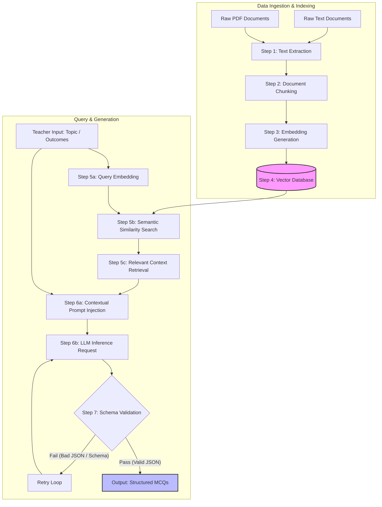

# RAG Pipeline & Question Generation Guide: From PDF/Text to Vector DB and LLM

This document provides a detailed step-by-step breakdown of how to implement a Retrieval-Augmented Generation (RAG) pipeline to ingest course material (PDFs and Text files), process them into a Vector Database, retrieve relevant context, and generate high-quality multiple-choice questions (MCQs).

---

## 🏗️ System Architecture & Data Flow



---

## 🔍 Detailed Step-by-Step Breakdown

### Step 1: Input Pre-processing & Text Extraction
Raw documents (such as lecture notes, textbooks, or curricula) can come in various formats, primarily **PDF** and **plain text**.
- **Plain Text (`.txt`)**: Read directly into memory with standard encoding handling.
- **PDF Documents (`.pdf`)**: Parsed using Python libraries like `pypdf`, `pdfplumber`, or `PyPDF2`. Since PDFs contain formatting characters, headers, and footers, we clean the extracted string by removing excessive whitespaces and non-printable characters.

### Step 2: Document Chunking (Splitting)
LLMs have context window limits, and embedding long documents directly reduces retrieval precision. Thus, documents must be split into smaller, coherent chunks.
- **Chunk Size**: The size of each chunk (typically 500–1000 characters or 150–250 tokens).
- **Chunk Overlap**: Overlapping contiguous chunks (usually 10–20% of chunk size) ensures context is not lost at the boundary of a cut.
- **Strategy**: A recursive character text splitter splits by double newlines (paragraphs), then single newlines, then spaces, maintaining semantic coherence.

### Step 3: Embedding Generation
An embedding model converts text chunks into dense, high-dimensional vector representations ($N$-dimensional floats) that capture semantic meaning.
- **OpenAI**: `text-embedding-3-small` (1536 dimensions) or `text-embedding-3-large` (3072 dimensions).
- **Gemini**: `models/text-embedding-004` (768 dimensions).
- **Local/Ollama**: `nomic-embed-text` or `all-minilm`.

### Step 4: Vector Database Storage
Vector databases index high-dimensional embeddings to enable fast similarity search.
- **ChromaDB**: An excellent open-source, lightweight, and embeddable database ideal for development and localized deployment.
- **Metadata**: Along with the embedding, we store metadata (e.g., `source_file`, `page_number`, `chunk_index`) to trace questions back to their source.

### Step 5: Semantic Retrieval (Similarity Search)
When a user requests questions on a specific `topic` or `learning_outcome`:
1. The query text is converted into a vector using the **same** embedding model.
2. The Vector DB performs a similarity search (using metrics like **Cosine Similarity** or **L2 Distance**) between the query vector and the stored chunk vectors.
3. The top-$k$ (e.g., $k=3$) most relevant text chunks are retrieved.

### Step 6: Contextual Prompt Injection & LLM Generation
The retrieved chunks are formatted and injected into the LLM system prompt as the "ground truth" context.
- **Prompt Engineering**: The LLM is instructed to generate questions **only** based on the provided context to prevent hallucinations.
- **Structured Output**: We require the LLM to output structured JSON matching a strict schema (e.g., Pydantic model for MCQ).

### Step 7: Post-generation Validation
To guarantee that the outputs can be parsed by Moodle and the WebSocket server:
1. Validate that the response is valid JSON.
2. Confirm all required fields (`question`, `choices`, `correct_index`, `explanation`) are present and typed correctly.
3. Verify that `correct_index` maps to a valid index in the `choices` array (index 0 to 3).
4. Run a retry loop (up to 3 times) if the validation fails.

---

## ⚠️ What if No Data is Found in the Source?

In real-world deployment, there are scenarios where no source data is returned (e.g., the uploaded document is empty, corrupted, or the Vector DB query returns no chunks above a similarity threshold). We handle this using **three design strategies**:

### 1. Parametric Knowledge Fallback (Hybrid Mode)
If the document or retrieved context is empty, the pipeline dynamically transitions from **Strict RAG** to **General Knowledge** generation.
- **How it works**: The system drops the strict prompt constraint (`"Base questions strictly on the following context..."`) and instructs the LLM to generate questions based purely on its own trained parametric knowledge for the requested `topic`.
- **Implementation**: The prompt formatter checks if `context` is empty (`not context.strip()`), and if so, omits the context injection section entirely.

### 2. Strict Generation Mode (Validation & Alerting)
If the quiz must be strictly aligned with specific curriculum guidelines (e.g., standard examinations where questions must be verifiable from course material):
- **Action**: When the similarity search returns 0 matching chunks or all retrieved chunks have a similarity score below a designated threshold (e.g., Cosine Similarity $< 0.3$), the API raises an explicit validation exception:
  `"No relevant content from source documents was found matching the topic: '<topic>'. Please upload a valid document or adjust the query."`

### 3. Default Document Snippet Fallback
To ensure the LLM has some context even when semantic search matching fails:
- **Action**: Fallback to returning the first few chunks of the document, or chunks corresponding to the table of contents/glossary, to allow the LLM to at least identify the style and terminology of the course material.

---

## 💻 Full Python Implementation Demo (Local-First)

To run this pipeline completely locally on your machine without any external APIs, install the required packages:
```bash
pip install pypdf chromadb requests python-dotenv pydantic
```

Make sure **Ollama** is running locally (e.g., `http://localhost:11434`) and you have pulled the required models:
```bash
ollama pull nomic-embed-text
ollama pull deepseek-coder:latest
```

Here is a complete, self-contained Python script implementing the entire local pipeline:

```python
import os
import json
import re
from typing import List, Optional
from pydantic import BaseModel, Field
from pypdf import PdfReader
import requests
import chromadb
from chromadb.utils import embedding_functions
from dotenv import load_dotenv

load_dotenv()

OLLAMA_URL = os.getenv("LOCAL_LLM_URL", "http://localhost:11434")
OLLAMA_GEN_MODEL = os.getenv("OLLAMA_MODEL", "deepseek-coder:latest")
OLLAMA_EMBED_MODEL = "nomic-embed-text"

# =====================================================================
# 📋 Pydantic Models for Structured Output
# =====================================================================
class Choice(BaseModel):
    text: str
    is_correct: bool

class Question(BaseModel):
    question: str
    choices: List[Choice]
    correct_index: int
    difficulty: str
    bloom_level: str
    explanation: str

# =====================================================================
# ⚙️ Step 1 & 2: Preprocessing, Extraction & Chunking
# =====================================================================
def extract_text_from_pdf(pdf_path: str) -> str:
    """Extracts and cleans text from a PDF file."""
    reader = PdfReader(pdf_path)
    full_text = []
    for page_num, page in enumerate(reader.pages):
        text = page.extract_text()
        if text:
            # Clean headers/footers or excessive whitespaces
            text = re.sub(r'\s+', ' ', text)
            full_text.append(text)
    return "\n\n".join(full_text)

def chunk_text(text: str, chunk_size: int = 1000, chunk_overlap: int = 200) -> List[str]:
    """Splits text into overlapping chunks of a specified size."""
    words = text.split(' ')
    chunks = []
    
    # Simple sliding window chunker
    i = 0
    while i < len(words):
        chunk_words = words[i:i + (chunk_size // 5)] # Estimate 5 chars per word
        chunks.append(" ".join(chunk_words))
        i += ((chunk_size - chunk_overlap) // 5)
        
    return [c.strip() for c in chunks if len(c.strip()) > 50]

# =====================================================================
# 🗄️ Step 3 & 4: Embeddings & Vector DB Storage (Ollama)
# =====================================================================
class VectorDBManager:
    def __init__(self, db_path: str = "./chroma_db"):
        # Initialize persistent ChromaDB client
        self.client = chromadb.PersistentClient(path=db_path)
        
        # Configure Local Ollama Embedding function
        self.emb_fn = embedding_functions.OllamaEmbeddingFunction(
            url=f"{OLLAMA_URL}/api/embeddings",
            model_name=OLLAMA_EMBED_MODEL
        )
        
        # Create or fetch collection
        self.collection = self.client.get_or_create_collection(
            name="course_materials",
            embedding_function=self.emb_fn
        )

    def add_document(self, file_path: str, chunks: List[str]):
        """Embeds and indexes document chunks into the Vector DB."""
        ids = [f"{os.path.basename(file_path)}_chunk_{idx}" for idx in range(len(chunks))]
        metadatas = [{"source": os.path.basename(file_path), "chunk_idx": idx} for idx in range(len(chunks))]
        
        self.collection.add(
            documents=chunks,
            ids=ids,
            metadatas=metadatas
        )
        print(f"✅ Indexed {len(chunks)} chunks from {os.path.basename(file_path)} into Vector DB.")

    def search(self, query: str, top_k: int = 3) -> List[str]:
        """Performs similarity search to retrieve the most relevant chunks."""
        results = self.collection.query(
            query_texts=[query],
            n_results=top_k
        )
        return results['documents'][0] if results['documents'] else []

# =====================================================================
# 🤖 Step 6 & 7: Prompt Injection, LLM Generation & Validation (Ollama)
# =====================================================================
class QuestionGenerator:
    def generate_questions(self, topic: str, context: str, n_questions: int = 2) -> List[Question]:
        system_prompt = "You are an expert educational content generator. You create structured multiple-choice questions."
        
        user_prompt = f"""[System: {system_prompt}]
        
Generate {n_questions} multiple-choice questions on the topic: "{topic}"
        
Requirements:
1. Base the questions strictly on the following context. Do not make up facts outside this text:
---
{context}
---
2. For each question, provide:
   - Clear question text
   - Exactly 4 choices (only one correct)
   - The index of the correct choice (0 to 3)
   - A detailed explanation of why the choice is correct

CRITICAL: Output ONLY a valid JSON array matching the structure below. Do not include markdown wraps or '```json'.

JSON Output Format:
[
  {{
    "question": "Question text here?",
    "choices": [
      {{"text": "Option A", "is_correct": true}},
      {{"text": "Option B", "is_correct": false}},
      {{"text": "Option C", "is_correct": false}},
      {{"text": "Option D", "is_correct": false}}
    ],
    "correct_index": 0,
    "difficulty": "medium",
    "bloom_level": "understanding",
    "explanation": "Explanation here..."
  }}
]
"""
        # Call Local Ollama Generate Endpoint
        response = requests.post(
            f"{OLLAMA_URL}/api/generate",
            json={
                "model": OLLAMA_GEN_MODEL,
                "prompt": user_prompt,
                "stream": False
            },
            timeout=120
        )
        response.raise_for_status()
        
        raw_content = response.json().get("response", "").strip()
        return self._validate_and_parse(raw_content)

    def _validate_and_parse(self, raw_content: str) -> List[Question]:
        """Cleans, parses, and validates the LLM response against Pydantic schema."""
        # Strip markdown json blocks if present
        if raw_content.startswith("```"):
            raw_content = re.sub(r'^```(json)?\n|```$', '', raw_content, flags=re.MULTILINE).strip()
            
        try:
            data = json.loads(raw_content)
            parsed_questions = []
            
            for item in data:
                # Validate correct_index bound checking
                correct_idx = item.get("correct_index", 0)
                if not (0 <= correct_idx < len(item.get("choices", []))):
                    raise ValueError(f"correct_index {correct_idx} out of range for choices")
                
                # Coerce correct choice flag mapping
                for idx, c in enumerate(item["choices"]):
                    c["is_correct"] = (idx == correct_idx)
                
                # Load into Pydantic to enforce exact types
                parsed_questions.append(Question(**item))
                
            return parsed_questions
        except Exception as e:
            print(f"❌ Validation failed: {e}. Raw content: {raw_content[:200]}")
            raise e

# =====================================================================
# 🚀 Execution Flow (End-to-End Orchestrator)
# =====================================================================
if __name__ == "__main__":
    # Create sample text file for demonstration
    sample_text_file = "sample_lecture.txt"
    with open(sample_text_file, "w") as f:
        f.write(
            "Photosynthesis is a process used by plants and other organisms to convert light energy "
            "into chemical energy that, through cellular respiration, can later be released to fuel the "
            "organisms' activities. This chemical energy is stored in carbohydrate molecules, such as sugars "
            "and starches, which are synthesized from carbon dioxide and water. The process takes place inside "
            "organelles called chloroplasts, which contain chlorophyll. Chlorophyll absorbs solar energy and "
            "uses it to drive the chemical reaction."
        )
    
    # 1. Load and Chunk input document
    with open(sample_text_file, "r") as f:
        raw_text = f.read()
    chunks = chunk_text(raw_text, chunk_size=300, chunk_overlap=50)
    
    # 2. Add to Vector DB
    db = VectorDBManager()
    db.add_document(sample_text_file, chunks)
    
    # 3. Retrieve relevant context for a specific topic
    target_topic = "Chloroplasts and Chlorophyll"
    retrieved_chunks = db.search(query=target_topic, top_k=2)
    combined_context = "\n\n".join(retrieved_chunks)
    print(f"\n🔍 Retrieved Context:\n{combined_context}\n")
    
    # 4. Generate & Validate Questions
    generator = QuestionGenerator()
    try:
        questions = generator.generate_questions(topic=target_topic, context=combined_context)
        print("\n🎉 Generated Questions:")
        print(json.dumps([q.model_dump() for q in questions], indent=2))
    except Exception as err:
        print(f"Failed to generate questions: {err}")
        
    # Cleanup demo file
    if os.path.exists(sample_text_file):
        os.remove(sample_text_file)
```

---

## 🔧 Integration with `llmapi/app.py`

In the current setup of `llmapi/app.py`, the `retrieve_relevant_context` function is structured as an in-memory cosine similarity retriever:
```python
def retrieve_relevant_context(query: str, document_text: str, backend: str, ...) -> str:
    # Splits document_text into 500-char chunks
    # Computes query and chunk embeddings on-the-fly via LLM API
    # Ranks using pure Python cosine_similarity
```

For production environments, you can modify `llmapi/app.py` to replace this function with a persistent database call to a Dockerized ChromaDB or Redis Vector service, avoiding the overhead of re-embedding the entire context file on every single HTTP request.
