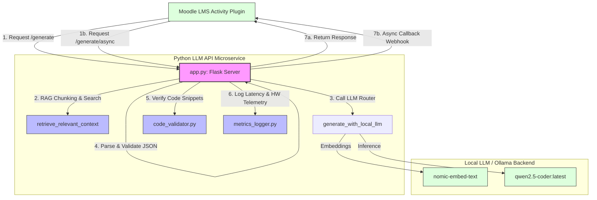
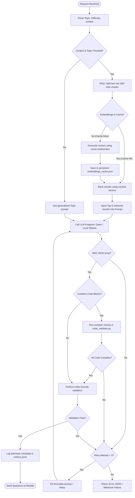

# JICA Moodle Quiz LLM API Service: Deep-Dive & Code Architecture

This document provides a comprehensive summary and code-level architectural breakdown of the Python-based LLM API service located in the `llmapi/` directory.

---

## 🏗️ Core Architecture Overview

The LLM API service is a stateless Python Flask microservice that serves as the interface between the LMS (Moodle) and various Language Model backends (both cloud-based APIs and locally hosted models). It orchestrates:
1. **Document Ingestion & RAG:** Chunking text and searching relevant segments via embeddings.
2. **LLM Inference Routing:** Directing calls to OpenAI, Google Gemini, or local Ollama instances.
3. **Determinism & Validation:** Parsing responses into standardized JSON schemas.
4. **Code Syntax Verification:** Compiling programming snippets inside generated questions to ensure correctness.
5. **System Telemetry:** Logging execution latency, hardware specs, and generation status for academic evaluations.



### 🔁 Question Generation & Validation Execution Flow

The following flowchart details the step-by-step logic executed inside the `execute_generation_single()` orchestrator for each request:



---

## 📂 Component Breakdown

### 1. `app.py` (The Service Hub)
Handles HTTP routing, request payload validation via Pydantic models, RAG vector similarity search, and generation orchestration.
* **Key Functions:**
  * `retrieve_relevant_context()`: Performs the in-memory RAG search. It chunks the lecture context into ~500-character segments, fetches vectors using the selected embedding backend, computes cosine similarity, and returns the top 3 chunks.
  * `generate_with_local_llm()`: Formulates the system instructions, connects to the local Ollama `/api/generate` endpoint, sends the prompt, cleans up markdown syntax from the response, and handles JSON parsing.
  * `execute_generation_single()`: The orchestrator function. It triggers RAG, makes the LLM call, runs question formatting checks, and operates a **retry loop (up to 3 attempts)** if the model returns invalid structures.
  * `_async_generation_worker()`: Runs in a background daemon thread for `async` requests, posting results back to Moodle via a callback webhook when done.

### 2. `code_validator.py` (The Compiler Guardian)
Crucial for computer science/coding quizzes. It parses the generated question text and options to extract markdown code blocks (e.g., ` ```python `) and checks if the code is syntactically correct.
* **Key Functions:**
  * `detect_language()`: Identifies target languages (Python, C++, Java, JS) from markdown tags or the question topic.
  * `validate_python()`: Compiles code using Python's native `compile(code, '<string>', 'exec')` function to catch syntax errors.
  * `validate_cpp()`: Pipes code directly into a local `g++` compiler process with the `-fsyntax-only` flag to check for compile errors without building binaries.
  * `validate_java()`: Writes code to a temporary file and runs a local `javac` compilation check.
  * `validate_question()`: Integrates all check-loops to ensure that any generated code-block works perfectly before the question is accepted.

### 3. `metrics_logger.py` (Evaluation Logging)
Captures granular system and performance data used to plot charts and compile tables for publication research papers.
* **Key Functions:**
  * `collect_hardware_snapshot()`: Gathers CPU info, OS details, RAM size, and available GPU names (by querying `nvidia-smi` when present).
  * `log_hardware_once()`: Writes host hardware details into `logs/evaluation/metrics.jsonl`.
  * `log_generation()`: Appends structured JSON metrics for every single generation request, capturing latency, token count, number of questions requested vs. generated, failures, and whether RAG was active.

---

## 📡 REST API Endpoints Detail

### 1. `POST /generate`
Synchronous endpoint to generate multiple-choice questions from a topic and optional context.
* **Payload Structure:**
  ```json
  {
    "topic": "Photosynthesis",
    "level": "medium",
    "n_questions": 3,
    "language": "en",
    "bloom_level": "application",
    "context": "Lecture text contents...",
    "backend": "local",
    "model": "qwen2.5-coder:latest"
  }
  ```
* **Response Status:** `200 OK` with JSON array of parsed, validated questions.

### 2. `POST /generate/async`
Asynchronous endpoint used to prevent gateway timeouts. Moodle forwards a webhook token and callback URL, and the service processes the generation in a background thread.
* **Response Status:** `202 Accepted` immediately. Sends final questions back to Moodle via `POST` webhook upon completion.

### 3. `GET /health`
Returns the status of the service, current default model, and backend configuration.
* **Response Status:** `200 OK`.

### 4. `GET /models/ollama`
Queries the local Ollama instance and returns list of pulled model tags currently cached on the server.
* **Response Status:** `200 OK`.

### 5. `POST /models/ollama/pull`
Instructs the local Ollama daemon to download a new model (e.g., `nomic-embed-text`) dynamically. Supports non-blocking proxy streaming of download percentage chunks back to the client.
* **Response Status:** `200 OK`.

### 6. `POST /validate`
Placeholder validation endpoint to check question quality.

---

## 🛠️ Code Cleanup Actions Taken

We have performed a complete code review and cleanup of `llmapi/app.py` to optimize execution and simplify the source file:
1. **Unused Imports Cleaned:** Removed `append_metric` from the `metrics_logger` imports in `app.py` since logging is abstracted by the wrapper functions `log_generation` and `log_hardware_once`.
2. **Consolidated Requests Library:** Moved all redundant inline `import requests` statements out of local helper functions (`_preload_ollama_models`, `retrieve_relevant_context`, `generate_with_local_llm`, `list_ollama_models`, and `pull_ollama_model`) and placed it as a single global import at the top of the file.
3. **Uniform Request Calls:** Replaced the legacy `requests as http_requests` alias inside `post_moodle_webhook()` with the standardized `requests.post` call, ensuring code consistency throughout the repository.
