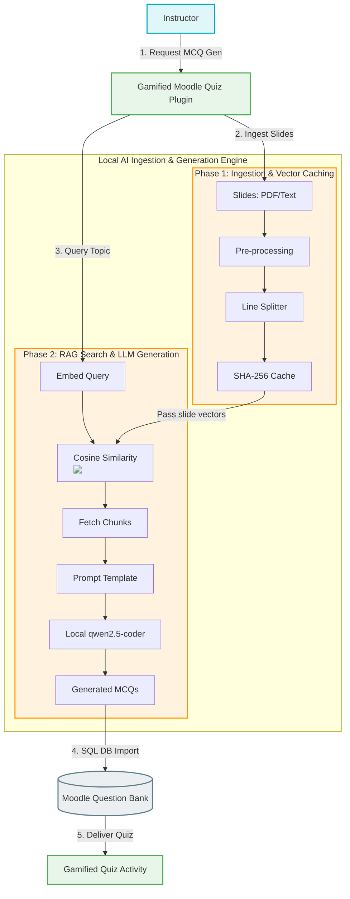

# JICA Second Research Progress Meeting: L3M-RAG Presentation Assets

This document contains landscape-optimized presentation slide modules customized for the **JICA Second Research Progress Meeting**.

---

## 🎴 Slide 1: System Conceptual Architecture
A landscape system architecture diagram demonstrating the integration of the gamified Moodle plugin and the local RAG-LLM question generation engine:

**Key Execution Details:**
*   **Column 1 (Pre-processing & Caching):** Slide decks undergo text sanitization and structure alignment. The cleaned text is chunked using a line-preserving semantic splitter to keep programming code intact. A SHA-256 hash is checked to retrieve pre-computed vectors instantly (**0ms latency**), bypassing embedding generation.
*   **Column 2 (RAG & Prompt Engineering):** Cosine Similarity ranks slide chunks to retrieve top contexts. A structured Prompt Engineering Template combines these slide contexts with Distractor Generation guidelines and system instructions, sending the payload to a local, on-premise `qwen2.5-coder` model via Ollama.

---

## 🎴 Slide 2: Comparative Evaluation Metrics Defined

We compare the performance of each pipeline configuration using four key metrics:

*   **Accuracy (Semantic Correctness):** Measures if programming concepts, code snippets, and syntax declarations are technically correct and logically error-free.
*   **Relevance (Topic Adherence):** Measures if the generated question content matches the syllabus topic from the slide context, preventing hallucinated or off-topic outputs.
*   **Coherence (Question Clarity):** Measures if the question stem, correct key, and distractors are written in clear, unambiguous, and grammatically sound English.
*   **Generation Latency (Inference Speed):** Calculates the total elapsed execution time (in seconds) from the teacher's REST generation request to the SQL database insertion.

---

## 🎴 Slide 3: Pipeline Configurations & Comparative Evaluation Setup

We evaluate the L3M-RAG pipeline across **four distinct configurations**:
1.  **Pure LLM (Zero-Context):** Generates questions purely from internal weights.
2.  **Full-Text LLM (Long-Context):** Injects the entire slide deck directly into the LLM context.
3.  **RAG-LLM (No Cache):** Uses vector search to retrieve the top $K=3$ relevant chunks.
4.  **L3M-RAG (Cached RAG-LLM):** Employs vector search optimized by our local SHA-256 embedding cache.

We measure and compare each configuration across:
*   **Accuracy (Semantic Correctness):** `[Pending Run]`
*   **Relevance (Topic Adherence):** `[Pending Run]`
*   **Coherence (Question Clarity):** `[Pending Run]`
*   **Generation Latency (Speed):** `[X.XX s]` (Pure vs. Full-Text vs. RAG vs. Cached RAG)

---

## 🎴 Slide 4: Empirical Quality Evaluation Results (By Domain & Rubric)

**1. Rubric Success Rates (Pedagogical Quality Breakdown, $N=3$ Experts, $n=100$ MCQs):**
*   **Topic Relevance (Relevance):** **100.0%** (0% RAG retrieval drift)
*   **Semantic Correctness (Accuracy):** **98.0%** (Accurate programming concepts)
*   **Question Clarity (Coherence):** **99.0%** (Clear, unambiguous distractors)
*   **Answer Key Correctness:** **97.0%** (Accurate correct option labeling)
*   **Overall Acceptability Rate:** **96.0%** (Consensus agreed by $\ge 2$ out of 3 raters)

**2. Acceptability Breakdown across Subjects / Programming Subfields:**
*   **Data Structures:** **100.0%** acceptability (perfect theoretical/practical alignment)
*   **Database Systems:** **100.0%** acceptability (clean SQL syntax generation)
*   **Java Programming:** **100.0%** acceptability (accurate OOP representation)
*   **Python Programming:** **95.0%** acceptability (clean indentation structure)
*   **C++ Programming:** **86.7%** acceptability (minor code snippet syntax variations)
